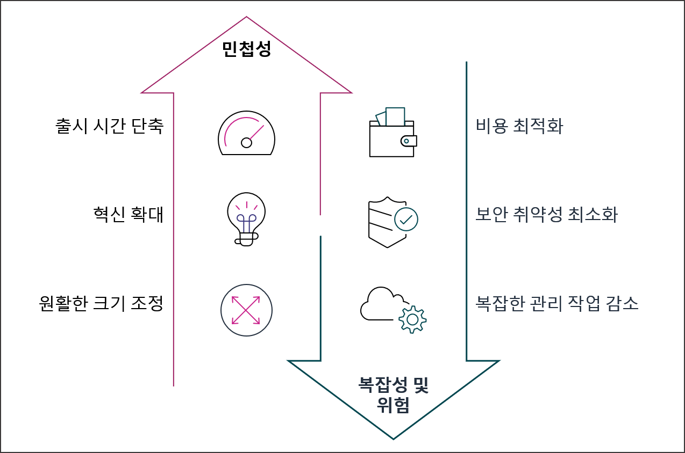
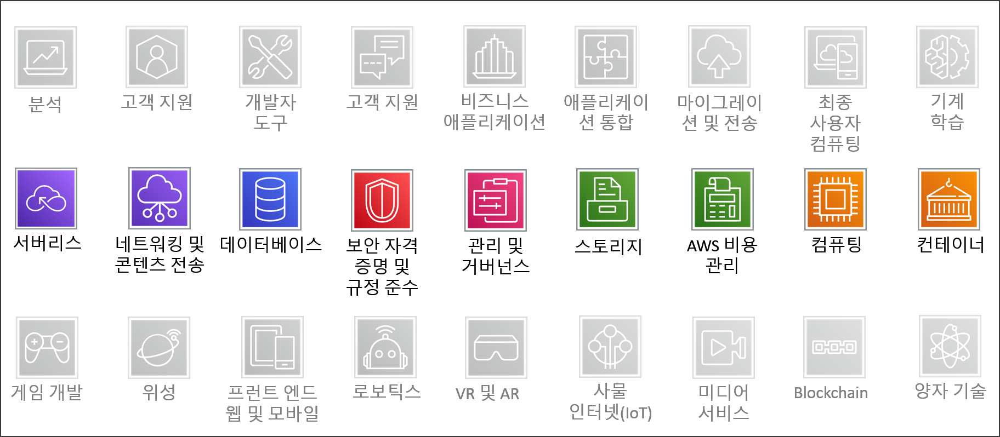
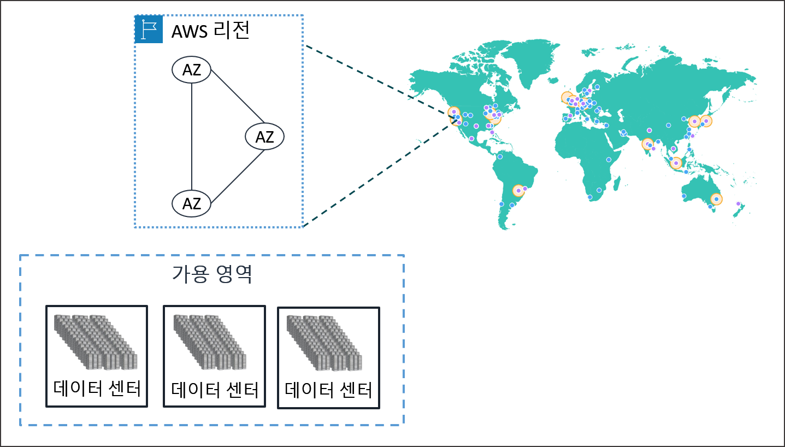
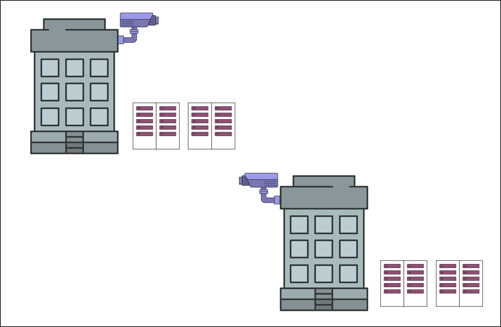
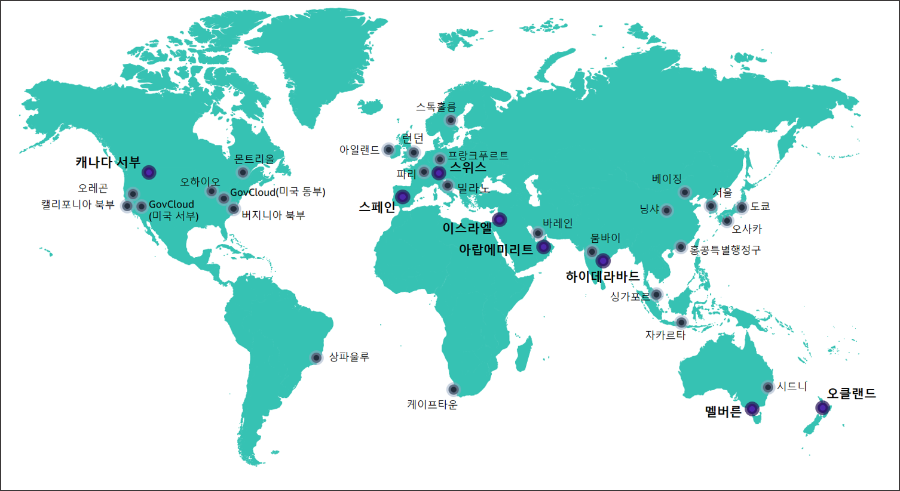
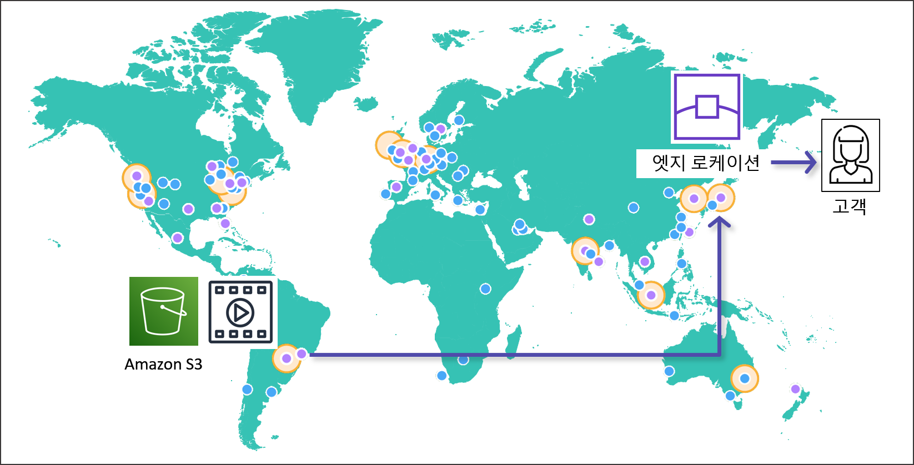

# AWS 아키텍팅 기초 및 글로벌 인프라

## 학습 목표
- 클라우드 컴퓨팅의 기본 개념 및 주요 마이그레이션 이점 이해
- 기존 전통적 IT 인프라 모델과 클라우드 아키텍처의 차이점 분석
- AWS 글로벌 인프라 구성 요소(데이터 센터, 가용 영역, 리전, 로컬 존, 엣지 로케이션) 작동 원리 파악
- 비즈니스 및 기술적 요구사항에 부합하는 최적의 리전 선택 결정 요인 분석

## 목차
- [1. 클라우드 컴퓨팅과 Amazon Web Services 기초](#1-클라우드-컴퓨팅과-amazon-web-services-기초)
  - [1.1 클라우드 컴퓨팅 개요](#11-클라우드-컴퓨팅-개요)
  - [1.2 주요 클라우드 제공업체 및 시장 점유율](#12-주요-클라우드-제공업체-및-시장-점유율)
  - [1.3 Amazon Web Services](#13-amazon-web-services)
- [2. AWS 글로벌 인프라스트럭처 아키텍처](#2-aws-글로벌-인프라스트럭처-아키텍처)
  - [2.1 물리 인프라 및 영역 체계](#21-물리-인프라-및-영역-체계)
  - [2.2 AWS Local Zones 및 엣지 네트워크](#22-aws-local-zones-및-엣지-네트워크)
- [3. AWS 계정 생성 및 EC2 인스턴스 생성 실습](#3-aws-계정-생성-및-ec2-인스턴스-생성-실습)
  - [3.1 계정 가입 및 리전 선택](#31-계정-가입-및-리전-선택)
  - [3.2 EC2 서비스 이동 및 대시보드 접근](#32-ec2-서비스-이동-및-대시보드-접근)
  - [3.3 EC2 인스턴스 세부 옵션 구성](#33-ec2-인스턴스-세부-옵션-구성)
  - [3.4 EC2 원격 SSH 접속](#34-ec2-원격-ssh-접속)
  - [3.5 Java 25 런타임 환경 구축](#35-java-25-런타임-환경-구축)
  - [3.6 개발 프로젝트 빌드 및 배포 파일 전송](#36-개발-프로젝트-빌드-및-배포-파일-전송)
  - [3.7 애플리케이션 포그라운드/백그라운드 실행 및 접속 테스트](#37-애플리케이션-포그라운드백그라운드-실행-및-접속-테스트)
  - [3.8 리눅스 패킷 포워딩 및 포트 재전송 (iptables)](#38-리눅스-패킷-포워딩-및-포트-재전송-iptables)

---

# 1. 클라우드 컴퓨팅과 Amazon Web Services 기초

## 1.1 클라우드 컴퓨팅 개요

### 1.1.1 클라우드 컴퓨팅 정의
- 인터넷 망을 통해 서버, 스토리지, 데이터베이스, 네트워킹 등 IT 리소스를 필요 시 즉시(On-Demand) 제공받고 실제 사용량에 따라서만 요금을 지불하는 컴퓨팅 모델.
- 물리적 데이터 센터 구축, 하드웨어 구매 수속, 설치 조달에 소요되는 시간적/비용적 부담을 제거하여 핵심 서비스 개발 및 고객 가치 창출에 역량을 집중 가능한 환경 제공.
- 자원 할당이 가상화 소프트웨어 조종으로 자동화되어 수 초 또는 수 분 내에 필요한 IT 자원을 생성하고 해제 가능.

### 1.1.2 기존 인프라 운영 방식과의 특성 차이
#### 1) 온프레미스 (On-Premise)
- 기업이 자체 전산실이나 서버실 시설을 구축하고 물리 서버, 전력, 냉각 설비, 네트워크 장비를 직접 소유하여 유지 관리하는 방식.
- 하드웨어 구매를 위한 초기 고정 자산 투자 비용이 막대하게 소요되며, 자원 확장 시 견적 수립, 발주, 납품, 서버 랙 마운트 설치까지 수 주에서 수 개월의 기간 지연 발생.

#### 2) 코로케이션 (Colocation)
- 기업 소유의 물리 서버 장비를 외부 전문 IDC(Internet Data Center) 공간에 입주시켜 전력, 항온항습 냉각 시설 및 물리 보안 관리만 위탁 이용하는 방식.
- 전산실 물리 시설 구축 비용은 절감되나, 하드웨어 소유권과 장비 유지보수 책임을 기업이 직접 담당하며 장기 랙 공간 임대 계약 방식 적용.

#### 3) 서버 호스팅 (Server Hosting)
- IDC 전문 업체의 물리 서버 장비를 월 단위 정액제 계약 형태로 임대 받아 이용하는 방식.
- 클라우드와 달리 물리 장비 세팅을 위한 작업 시간이 필요하며, 자원 자율 축소나 사용한 시간 단위 종량제 요금 정산이 지원되지 않음.

### 1.1.3 클라우드의 주요 이점



#### 1) 비즈니스 민첩성 향상 및 출시 시간 단축
- 인프라 확보 절차가 소프트웨어 호출 방식으로 단축되어 신속한 프로비저닝 [^1] (Provisioning)을 바탕으로 신규 기능 테스트 및 서비스 출시 가속화.

#### 2) 광범위한 기술 혁신 가속화
- 인프라 위험 부담 없이 아이디어를 즉시 구축하여 테스트 가능하며 컨테이너, 서버리스, 머신러닝, 인공지능(AI) 등 최신 기술 요소의 용이한 도입 지원.

#### 3) 유연한 용량 가용성 확보
- 트래픽 폭증이나 수요 변동에 맞추어 인프라 자원을 수동 또는 자동(Auto Scaling)으로 확장(Scale-out)하고 수요 경감 시 축소하여 가용성 유지.

#### 4) 인프라 비용 최적화
- 사전 대규모 고정 자산 투자 없이 실제 가동한 리소스 사용 시간 및 트래픽 양에 대해서만 정산하는 가변 운영 비용 모델 적용.

#### 5) 보안 및 내장 위험 경감
- 글로벌 수준의 데이터 센터 물리 보안과 최첨단 암호화 및 액세스 통제 서비스를 내장형으로 활용하여 인프라 보안 위험 완화.

#### 6) 물리적 운용 복잡성 경감
- 하드웨어 고장 교체, 데이터 센터 물리 관리 부담을 경감하고 관리형 서비스 [^2] (Managed Service) 활용을 통한 운영 복잡성 경감.

## 1.2 주요 클라우드 제공업체 및 시장 점유율

### 1.2.1 글로벌 하이퍼스케일 벤더
- Amazon Web Services (AWS): 2006년 상용 클라우드 서비스를 최초로 개척한 글로벌 리더로서 가장 광범위한 인프라 거점과 최다 관리형 서비스 보유.
- Microsoft Azure: 기존 기업형 윈도우 인프라, Active Directory 및 MS 제품군과의 연동성을 바탕으로 엔터프라이즈 B2B 시장 확장.
- Google Cloud Platform (GCP): 대규모 빅데이터 처리, 쿠버네티스 컨테이너 기술 및 인공지능 머신러닝 연구 환경에 특화된 서비스 환경 제공.

### 1.2.2 글로벌 인프라 시장 점유율 및 동향 (2026년 기준)
- 글로벌 주요 3대 기업(AWS, Azure, GCP)이 전체 글로벌 클라우드 인프라 시장의 60% 이상을 점유.
- 글로벌 시장 점유율 현황 (Synergy Research Group 2026년 최신 리서치 기준):
  - 1위 AWS: 약 28% 점유율로 시장 선도.
  - 2위 Microsoft Azure: 약 20% 점유율 기록.
  - 3위 Google Cloud: 약 15% 점유율 기록.
  - 기타: Alibaba Cloud, Oracle Cloud, IBM Cloud 및 인공지능(AI) 연산 자원에 특화된 신흥 전문 클라우드 [^10] (Neocloud) 기업들의 가파른 성장세 형성.

## 1.3 Amazon Web Services

- Amazon Web Services(AWS)는 아마존(Amazon)사가 전 세계 비즈니스 및 개발자에게 인터넷을 통해 IT 인프라와 솔루션을 종량제 기반으로 제공하는 세계 최대의 종합 클라우드 컴퓨팅 플랫폼.
- 글로벌 데이터 센터 망을 기반으로 서버, 스토리지, 데이터베이스 등 200개 이상의 독립 관리형 클라우드 서비스 제공.
  - 참고: https://aws.amazon.com/ko/products/

### 1.3.1 클라우드 서비스 제공 모델
- IaaS (Infrastructure as a Service): 서버, 스토리지, 네트워킹 등 가상화된 기본 IT 인프라 리소스를 제공하며, 운영체제 설치, 미들웨어 구성 및 애플리케이션 관리는 사용자가 직접 담당하는 서비스 모델. (대표 서비스: Amazon EC2, Amazon VPC, Amazon EBS)
- PaaS (Platform as a Service): 개발 런타임 및 실행 환경을 플랫폼으로 제공하여 하드웨어 및 OS 관리 부담 없이 애플리케이션 코드 작성과 서비스 배포에 집중 가능한 모델. (대표 서비스: AWS Elastic Beanstalk, AWS App Runner)
- SaaS (Software as a Service): 클라우드 제공업체가 관리하는 완성된 소프트웨어 애플리케이션을 웹 브라우저나 API를 통해 별도 설치 없이 즉시 이용하는 서비스 모델. (대표 서비스: Amazon WorkDocs, Amazon Chime, Amazon QuickSight)

### 1.3.2 핵심 서비스 영역
- 컴퓨팅: 가상 서버 환경인 EC2 및 이벤트 기반 서버리스 컴퓨팅 Lambda 지원.
- 스토리지: 무제한 객체 스토리지 S3 및 블록 레벨 저장소 EBS 제공.
- 데이터베이스: 관리형 관계형 데이터베이스 RDS 및 Key-Value NoSQL DynamoDB 지원.
- 네트워킹 및 콘텐츠 전송: 격리 가상 네트워크 VPC, 콘텐츠 전송망 CloudFront 및 DNS 서비스 Route 53 제공.
- 보안 자격 증명: 자격 증명 접근 관리 IAM 및 통합 보안 정책 제공.



# 2. AWS 글로벌 인프라스트럭처 아키텍처

## 2.1 물리 인프라 및 영역 체계



### 2.1.1 데이터 센터 (Data Center)
- AWS 서비스가 실제로 작동하는 수천 대의 물리 서버 장비들이 배치된 거점.
- 전용 네트워크 장비 운용 및 외부 제3자 감사를 통한 엄격한 물리 통제 및 보안 규정 준수 검증.
- 하나 이상의 물리 데이터 센터가 모여 하나의 독립된 가용 영역을 구성.



### 2.1.2 가용 영역 (AZ, Availability Zone)
- 독립된 이중화 전력 설비, 전용 냉각 장치 및 고속 네트워크 망을 갖춘 하나 이상의 물리 데이터 센터 집합.
  - 2026년 기준 123개 가용 영역 운용
- 지진 단층대 및 저지대를 회피하여 물리적으로 이격 설계되며, 각 가용 영역은 독립 변전소로부터 전력 공급.
- 가용 영역들은 초고속 프라이빗 전용 링크로 상호 연결되어 지연 시간을 최소화.
- 고가용성 체계 및 내결함성 [^6] (Fault Tolerance) 확보를 위해 최소 2개 이상의 가용 영역에 자원을 분산 배치하는 Multi-AZ 구성 권장.

### 2.1.3 리전 (Region)
- 전 세계 주요 지리적 거점에 분산되어 2개 이상의 독립적인 가용 영역들을 포함하는 물리적 영역.
  - 2026년 기준 39개 리전 운용
- 각 리전 간 시스템은 완전히 격리되어 운용되며, 리전 간 자원은 자동으로 복제되지 않는 데이터 주권 및 격리 구조 유지.
- 참고: https://aws.amazon.com/ko/products/



### 2.1.4 최적의 리전 선택 결정 요인
#### 1) 법적 규제 준수 및 데이터 주권
- 국가별 개인정보 보호법, 데이터 국외 이전 제한 및 기업 내부 데이터 관리 규정 등 법적 요건 준수 여부 고려.

#### 2) 지연 시간 (Latency)
- 주요 서비스 이용자와의 지리적 거리를 최소화하여 네트워크 지연 시간 [^7] (Latency) 경감.

#### 3) 서비스 가용성
- 글로벌 리전별로 개별 제공되는 AWS 서비스 품목 및 신규 기능 지원 현황 검토.

#### 4) 리전별 요금 체계
- 지역별 수수료 정책 및 인프라 운용 비용 차이 검토.

## 2.2 AWS Local Zones 및 엣지 네트워크

### 2.2.1 AWS Local Zones (로컬 존)
- 컴퓨팅, 스토리지, 데이터베이스 등 핵심 AWS 서비스를 대도시 인구 밀집 지역 근처에 배치하여 초저지연 연산 환경을 제공하는 인프라 확장 형태.
- 주요 리전의 부모 가용 영역과 고속 전용선으로 연결되어 온프레미스 워크로드 [^9] (Workload)의 클라우드 연동 지원.

### 2.2.2 엣지 로케이션 (Edge Location) 및 POP
- 사용자 근접 거점에 배치되어 최단 지연 시간으로 데이터 및 콘텐츠를 캐싱 전송하는 접속 지점(Point of Presence).
- Amazon CloudFront CDN 및 Amazon Route 53 전역 DNS 서비스의 캐시 서버로 동작.



### 2.2.3 2단계 데이터 캐싱 계층 메커니즘
- 엣지 로케이션 캐시: 전 세계 주요 도시에 위치하여 최종 사용자 요청에 실시간 캐시 데이터 즉시 응답.
- 리전 엣지 캐시 (Regional Edge Cache): 엣지 로케이션과 오리진 [^8] (Origin) 서버(S3, EC2 등) 사이에 위치하는 중간 캐싱 계층.
- 자주 액세스되지 않아 엣지 로케이션에서 만료된 콘텐츠를 리전 엣지 캐시 수준에서 재확인하여 오리진 서버의 직접 트래픽 부하 경감.

# 3. AWS 계정 생성 및 EC2 인스턴스 생성 실습

- AWS 계정 생성시 해외 결제가 가능한 신용카드나 체크카드 필요
- 카드상의 소유자 이름, 비밀번호 앞 2자리, 생년월일을 입력하면 등록 가능

## 3.1 계정 가입 및 리전 선택
- AWS 공식 웹 콘솔 접속 후 계정 생성 및 로그인
  - URL: https://aws.amazon.com
- 서울 리전 선택
  - 위치: AWS 관리 콘솔 화면 최상단 우측 내비게이션 바 (계정 이름 옆의 글로벌 드롭다운 메뉴)
  - 선택 방법: 드롭다운 메뉴 클릭 후 아시아 태평양(서울) ap-northeast-2 선택
  - 상세 설명: 국내 이용자 및 국내 서비스 대상 네트워크 요청 지연 시간을 극소화하고 데이터 국내 저장 규정을 준수하기 위한 지리적 인프라 거점 지정

## 3.2 EC2 서비스 이동 및 대시보드 접근
- EC2 서비스 이동
  - AWS 관리 콘솔 최상단 검색바(Search) 또는 좌상단 [서비스] 메인 메뉴
  - 검색창에 EC2 검색 후 결과 항목의 [EC2 - 클라우드의 가상 서버] 클릭하여 이동
- EC2 인스턴스 생성 마법사 진입
  - EC2 대시보드 우측 상단의 [인스턴스 시작] 주황색 버튼 클릭

## 3.3 EC2 인스턴스 세부 옵션 구성
- 이름 및 태그
  - 가상 서버 인스턴스를 구별하기 위한 대표 식별 이름 태그 설정
  - 이름: first-instance
- 애플리케이션 및 OS이미지(Amazon Machine Image)
  - AWS에 최적화된 리눅스 운영체제 이미지 및 표준 64비트 아키텍처 환경 지정
  - Quick Start: Amazon Linux
  - Amazon Machine Image(AMI): Amazon Linux 2023 kernel-6.18 AMI
  - 아키텍처: 64비트(x86)
- 인스턴스 유형
  - 2개 가상 CPU와 1GiB 메모리를 갖춘 소규모 인스턴스 규격 선택
  - 인스턴스 유형: t3.micro
  - 2 vCPU, 1 GiB 메모리, Linux: 시간당 $0.0104(30일 $7.5)
- 키 페어(로그인)
  - SSH 원격 접속 시 사용하는 비대칭 암호화 키 파일(.pem) 생성 및 저장
  - 새 키 페어 생성
    - 키 페어 이름: first-key
    - 키 페어 유형: RSA
    - 프라이빗 키 파일 형식: .pem
    - `키 페어 생성` 클릭 후 first-key.pem 파일 다운로드
  - 키 페어 이름: first-key
- 네트워크 설정
  - 원격 터미널 접속(22번), 암호화 웹 접속(443번), 기본 웹 접속(80번) 포트 트래픽 허용을 위한 방화벽 보안 그룹 지정
  - 방화벽(보안 그룹): 보안 그룹 생성
  - ☑️ 다음에서 SSH 트래픽 허용: 위치 무관
  - ☑️ 인터넷에서 HTTPS 트래픽 허용
  - ☑️ 인터넷에서 HTTP 트래픽 허용
- 스토리지 구성
  - 8 GiB 용량의 gp3 범용 SSD 고성능 가상 블록 저장소 연결
  - 8 GiB gp3
- 고급 세부 정보
  - CPU 사용량 스파이크 발생 시 기본 크레딧 범위 내에서 연산 성능 버스트 허용
  - 크레딧 사양: 표준
- `인스턴스 시작` 클릭
  - 최종 가상 서버 인스턴스 생성 및 가동 시작

---

## 3.4 EC2 인스턴스 원격 SSH 접속
- 다운로드한 SSH 프라이빗 키(first-key.pem)를 활용하여 EC2 인스턴스 퍼블릭 IP로 접속

```sh
ssh -i "first-key.pem" ec2-user@<EC2의 퍼블릭 IP>
```

---

## 3.5 Java 25 런타임 환경 (Temurin JDK) 설치
- Spring Boot 구동을 위해 Amazon Linux 2023 환경에 Eclipse Temurin Java 25 JDK 저장소 등록 및 설치
- 참고 공식 가이드: https://adoptium.net/installation

### 3.5.1 시스템 패키지 최신화
- 패키지 인덱스를 최신 버전으로 업데이트

```sh
sudo yum update -y
```

### 3.5.2 Adoptium YUM 저장소 등록
- Java 25 패키지를 제공하는 Adoptium 외부 저장소 설정 파일(/etc/yum.repos.d/adoptium.repo) 생성

```sh
sudo tee /etc/yum.repos.d/adoptium.repo << 'EOF'
[Adoptium]
name=Adoptium
baseurl=https://packages.adoptium.net/artifactory/rpm/amazonlinux/2/x86_64
enabled=1
gpgcheck=1
gpgkey=https://packages.adoptium.net/artifactory/api/gpg/key/public
EOF
```

### 3.5.3 저장소 설정 파일 검증
- 생성된 저장소 파일 설정 내용 확인

```sh
cat /etc/yum.repos.d/adoptium.repo
```

### 3.5.4 Temurin Java 25 JDK 패키지 설치
- 저장소로부터 Temurin JDK 25 패키지 설치

```sh
sudo yum install temurin-25-jdk -y
```

### 3.5.5 Java 설치 및 버전 확인
- 자바 컴파일러 및 런타임 버전 출력 확인

```sh
java --version
```

### 3.5.6 JAVA_HOME 환경변수 등록 및 적용
- 전역 프로파일(/etc/profile)에 JAVA_HOME 경로 등록 및 설정 반영

```sh
echo 'export JAVA_HOME=/usr/lib/jvm/java-25-temurin-jdk' | sudo tee -a /etc/profile
source /etc/profile
```

---

## 3.6 개발 프로젝트 빌드 및 EC2 파일 전송

### 3.6.1 키 파일 복사 및 Git 보안 관리 (.gitignore 설정)
- 프로젝트 루트에 first-key.pem 파일 복사
- SSH 보안 키 파일(.pem)의 외부 유출 방지를 위한 .gitignore 예외 규칙 등록

```gitignore
**/*.pem
```

### 3.6.2 Spring Boot 애플리케이션 빌드 및 배포 파일 전송
#### 1) 빌드
- IntelliJ IDE 우측 [Gradle] 탭 선택 > [Tasks] 메뉴 확장 > [build] 카테고리 확장 > [bootJar] 항목을 더블 클릭하여 실행 가능한 스프링 부트 Jar 아카이브 생성
- 터미널 커맨드라인 실행: 프로젝트 루트 디렉터리에서 `./gradlew bootJar` 그래들 래퍼 명령어 입력으로도 동일하게 빌드 가능
- 빌드 결과물 생성 경로: `build/libs/프로젝트명-0.0.1-SNAPSHOT.jar`

#### 2) EC2 서버에 빌드 결과물 전송
- git bash 환경에서 실행

```sh
scp -i "first-key.pem" build/libs/프로젝트명-0.0.1-SNAPSHOT.jar ec2-user@<EC2의 퍼블릭 IP>:/home/ec2-user/
```

---

## 3.7 애플리케이션 포그라운드/백그라운드 실행 및 접속 테스트

### 3.7.1 스프링 부트 애플리케이션 직접 실행
- SSH로 EC2에 접속한 상태에서 스프링 부트 애플리케이션 실행

```sh
java -jar spring-board-0.0.1-SNAPSHOT.jar
```

### 3.7.2 보안 그룹에 8080번 포트 인바운드 규칙 추가
- 보안 그룹 콘솔로 이동:
  - AWS EC2 > 인스턴스 > 생성한 인스턴스의 체크박스 선택 > 하단 [보안] 탭의 보안 그룹항목의 sg-xxx(launch-wizard-1) 클릭
- 인바운드 방화벽 규칙 편집:
  - 하단 [인바운드 규칙] 탭 선택 후 우측 [인바운드 규칙 편집] 버튼 클릭
  - [규칙 추가] 버튼 클릭 후 아래 항목 입력:
    - 유형: 사용자 지정 TCP
    - 포트 범위: 8080
    - 소스: 사용자 지정, 우측의 드롭다운 클릭해서 `0.0.0.0/0` 선택
  - 우측 하단 [규칙 저장] 버튼 클릭하여 설정 반영

### 3.7.3 웹 브라우저 접속 테스트
- 주소창 입력 및 연결 확인:
  - 웹 브라우저를 열고 `http://<EC2의 퍼블릭 IP>:8080` 입력하여 Spring Boot 게시판 메인 페이지 정상 응답 확인

### 3.7.4 백그라운드 무중단 실행 (nohup)
- 터미널 포그라운드 프로세스 종료:
  - SSH 터미널 창에서 Ctrl + C 키를 눌러 기존 포그라운드 실행 중지
- nohup 백그라운드 무중단 구동 및 로그 저장:
  - SSH 접속 종료 후에도 상시 동작하도록 백그라운드 모드로 실행하고 출력 로그를 app.log 파일로 누적 저장

```sh
# nohup: 터미널 세션 접속 종료 시에도 상시 구동
# > app.log: 표준 출력을 app.log에 기록
# 2>&1: 표준 에러를 표준 출력으로 통합
# &: 백그라운드 모드 실행
nohup java -jar spring-board-0.0.1-SNAPSHOT.jar > app.log 2>&1 &
```

---

## 3.8 리눅스 패킷 포워딩 및 포트 재전송 (iptables)

### 3.8.1 iptables 방화벽 서비스 설치 및 데몬 활성화
- 커널 패킷 필터링 조종용 iptables 설치 및 데몬 활성화

```sh
# iptables 서비스 설치
sudo yum install -y iptables-services

# 서비스 활성화 및 시작
sudo systemctl enable iptables
sudo systemctl start iptables
```

### 3.8.2 80번 HTTP 포트를 8080번 애플리케이션 포트로 리다이렉트
- 80번 웹 포트 접근 트래픽을 8080번 애플리케이션 포트로 리다이렉트 지정 및 설정 저장

```sh
# 1. 80 포트로 들어온 요청을 8080으로 리다이렉트 (PREROUTING)
sudo iptables -t nat -A PREROUTING -p tcp --dport 80 -j REDIRECT --to-port 8080

# 2. 로컬(localhost)에서 80으로 요청할 경우를 위한 설정 (OUTPUT)
sudo iptables -t nat -A OUTPUT -p tcp --dport 80 -o lo -j REDIRECT --to-port 8080

# 3. 8080 포트 인바운드 허용 규칙을 REJECT 앞에(5번) 추가
sudo iptables -I INPUT 5 -p tcp --dport 8080 -j ACCEPT

# 4. 설정 저장
sudo service iptables save
```

### 3.8.3 방화벽 체인 및 NAT 리다이렉트 설정 규칙 검증
- 등록된 패킷 필터링 및 NAT 포워딩 규칙 검증

#### 1) 패킷 필터링 규칙 확인
```sh
sudo iptables -L -n -v
```

- 정상 등록 시 패킷 필터링 테이블 출력 예시:

```sh
Chain INPUT (policy ACCEPT 0 packets, 0 bytes)
 pkts bytes target     prot opt in     out     source               destination         
 4530  471K ACCEPT     all  --  *      *       0.0.0.0/0            0.0.0.0/0            state RELATED,ESTABLISHED
    0     0 ACCEPT     icmp --  *      *       0.0.0.0/0            0.0.0.0/0           
    3   180 ACCEPT     all  --  lo     *       0.0.0.0/0            0.0.0.0/0           
   30  1588 ACCEPT     tcp  --  *      *       0.0.0.0/0            0.0.0.0/0            state NEW tcp dpt:22
   38  1908 ACCEPT     tcp  --  *      *       0.0.0.0/0            0.0.0.0/0            tcp dpt:8080
  115  6164 REJECT     all  --  *      *       0.0.0.0/0            0.0.0.0/0            reject-with icmp-host-prohibited

Chain FORWARD (policy ACCEPT 0 packets, 0 bytes)
 pkts bytes target     prot opt in     out     source               destination         
    0     0 REJECT     all  --  *      *       0.0.0.0/0            0.0.0.0/0            reject-with icmp-host-prohibited

Chain OUTPUT (policy ACCEPT 4388 packets, 435K bytes)
 pkts bytes target     prot opt in     out     source               destination
```

#### 2) 필터링 규칙 삭제
- 패킷 필터링 설정 오류 발생 시 규칙 삭제 후 재등록

```sh
sudo iptables -D INPUT -p tcp --dport 8080 -j ACCEPT
```

#### 3) NAT 테이블 규칙 확인
```sh
sudo iptables -t nat -L -n -v
```

- 정상 등록 시 NAT 테이블 체인 출력 예시:

```sh
Chain PREROUTING (policy ACCEPT 0 packets, 0 bytes)
 pkts bytes target     prot opt in     out     source               destination         
    0     0 REDIRECT   tcp  --  *      *       0.0.0.0/0            0.0.0.0/0            tcp dpt:80 redir ports 8080

Chain INPUT (policy ACCEPT 0 packets, 0 bytes)
 pkts bytes target     prot opt in     out     source               destination         

Chain OUTPUT (policy ACCEPT 0 packets, 0 bytes)
 pkts bytes target     prot opt in     out     source               destination         
    0     0 REDIRECT   tcp  --  *      lo      0.0.0.0/0            0.0.0.0/0            tcp dpt:80 redir ports 8080

Chain POSTROUTING (policy ACCEPT 0 packets, 0 bytes)
 pkts bytes target     prot opt in     out     source               destination
```

#### 4) NAT 포워딩 규칙 초기화
- NAT 포워딩 설정 오류 발생 시 규칙 전체 초기화 후 재등록

```sh
# NAT 테이블 규칙 전체 초기화
sudo iptables -t nat -F
```

---

[^1]: 프로비저닝 (Provisioning): 사용자의 요청에 따라 IT 인프라 자원을 할당, 배치, 생성하여 이용 가능한 상태로 만드는 과정.
[^2]: 관리형 서비스 (Managed Service): 클라우드 제공업체가 하드웨어 패치, 백업, 운용 관리를 대행해 주는 서비스 형태.
[^3]: 가용 영역 (Availability Zone): 하나의 리전 내에서 재해에 대비하여 지리적으로 격리된 고속 네트워크로 연결된 독립 데이터 센터 집합.
[^4]: 리전 (Region): AWS가 전 세계적으로 서비스를 제공하기 위해 운영하는 물리적인 지리적 영역.
[^5]: 엣지 로케이션 (Edge Location): 데이터 전송 지연 시간을 줄이기 위해 사용자 근처 주요 도시에 설치된 캐시 서버 거점.
[^6]: 내결함성 (Fault Tolerance): 시스템 일부 구성 요소에 장애가 발생해도 서비스 중단 없이 정상 작동을 유지하는 능력.
[^7]: 지연 시간 (Latency): 네트워크 상에서 데이터 패킷이 요청자로부터 목적지까지 전송되는 데 걸리는 시간.
[^8]: 오리진 (Origin): 캐시 서버가 원본 데이터를 가져오는 최종 원본 저장소(Amazon S3 버킷, EC2 인스턴스 등).
[^9]: 워크로드 (Workload): 서버나 클라우드 시스템에서 실행되고 처리되는 애플리케이션, 데이터베이스 및 업무 작업 일체.
[^10]: 네오클라우드 (Neocloud): 대규모 AI 모델 학습 및 연산 처리에 특화된 최신 고성능 GPU 기반 전용 인프라를 제공하는 신흥 전문 클라우드 기업.
