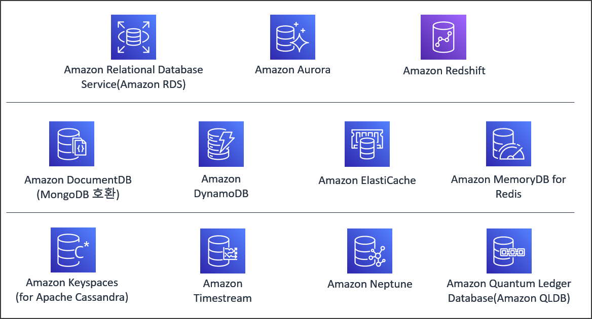
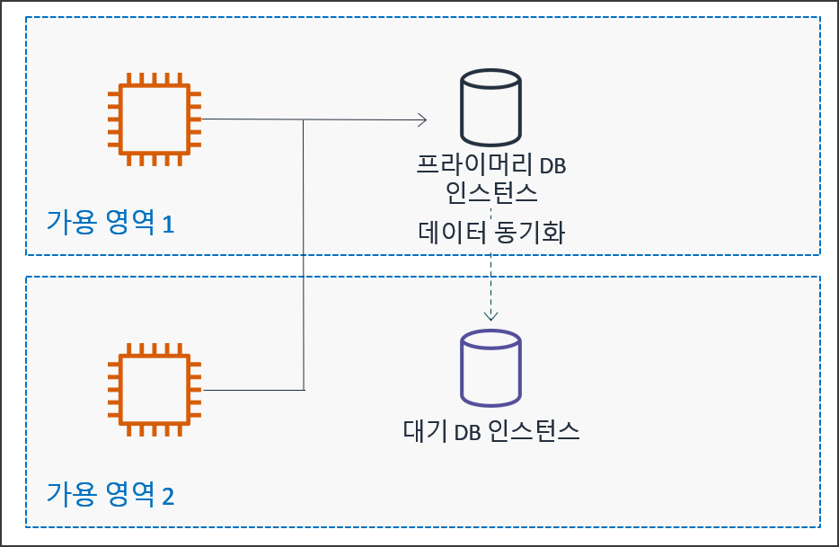
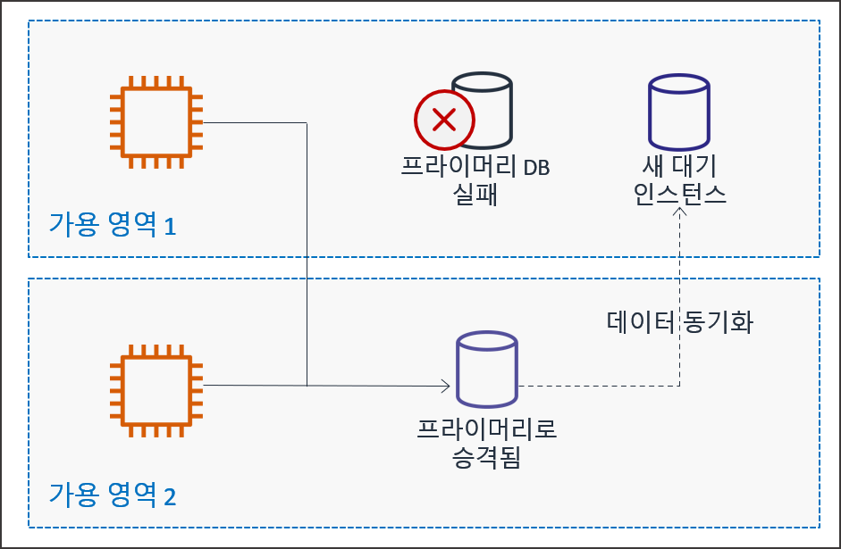
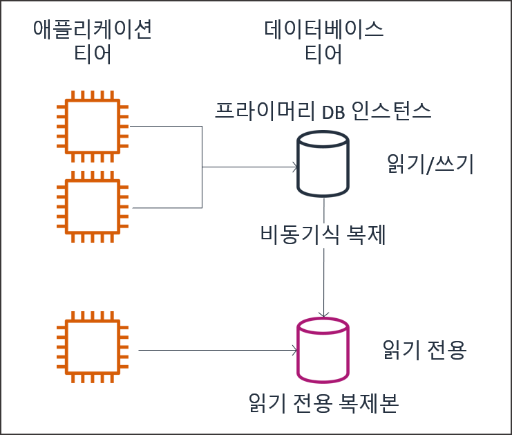

# AWS 데이터베이스 서비스 및 RDS 아키텍처

## 학습 목표
- AWS 관계형(SQL) 및 비관계형(NoSQL) 데이터베이스 서비스 유형별 특징 비교
- Amazon RDS 관리형 서비스 아키텍처, Multi-AZ 고가용성 및 읽기 전용 복제본(Read Replica) 원리 습득
- DB 파라미터 그룹을 활용한 타임존 및 utf8mb4 인코딩 설정법 파악
- RDS 자동 백업, 수동 스냅샷 및 특정 시점 복구(PITR) 동작 매커니즘 이해
- AWS 관리 콘솔을 활용한 RDS DB 인스턴스 생성 및 환경 구성 실습 완수

## 목차
- [1. AWS 데이터베이스 서비스 개요 및 유형 비교](#1-aws-데이터베이스-서비스-개요-및-유형-비교)
  - [1.1 SQL 및 NoSQL 데이터베이스 아키텍처 비교](#11-sql-및-nosql-데이터베이스-아키텍처-비교)
  - [1.2 관리형 데이터베이스와 비관리형 데이터베이스](#12-관리형-데이터베이스와-비관리형-데이터베이스)
- [2. Amazon Relational Database Service (Amazon RDS) 세부 아키텍처](#2-amazon-relational-database-service-amazon-rds-세부-아키텍처)
  - [2.1 Amazon RDS 핵심 기능 및 6대 데이터베이스 엔진](#21-amazon-rds-핵심-기능-및-6대-데이터베이스-엔진)
  - [2.2 Multi-AZ 고가용성 배포 및 자동 장애 조치](#22-multi-az-고가용성-배포-및-자동-장애-조치)
  - [2.3 읽기 전용 복제본 (Read Replica)을 통한 읽기 확장](#23-읽기-전용-복제본-read-replica을-통한-읽기-확장)
  - [2.4 DB 파라미터 그룹 및 옵션 그룹 설정](#24-db-파라미터-그룹-및-옵션-그룹-설정)
  - [2.5 RDS 백업, 스냅샷 및 특정 시점 복구 (PITR)](#25-rds-백업-스냅샷-및-특정-시점-복구-pitr)
  - [2.6 스토리지 타입 및 자동 확장 (Storage Auto Scaling)](#26-스토리지-타입-및-자동-확장-storage-auto-scaling)
- [3. AWS 관리 콘솔 기반 RDS 인스턴스 환경 구성](#3-aws-관리-콘솔-기반-rds-인스턴스-환경-구성)
  - [3.1 RDS DB 인스턴스 프로비저닝 및 기본 구성](#31-rds-db-인스턴스-프로비저닝-및-기본-구성)
  - [3.2 데이터베이스 초기 작업](#32-데이터베이스-초기-작업)
  - [3.3 개발 프로젝트의 DB 접속 정보 수정](#33-개발-프로젝트의-db-접속-정보-수정)

---

# 1. AWS 데이터베이스 서비스 개요 및 유형 비교

## 1.1 SQL 및 NoSQL 데이터베이스 아키텍처 비교

### 1.1.1 관계형 데이터베이스 (SQL / RDBMS)
- 명확하게 정의된 스키마 [^1] (Schema) 구조와 테이블 간의 관계(Relationship)를 바탕으로 데이터를 관리하는 방식.
- 데이터의 엄격한 일관성과 무결성 보장을 위해 ACID [^2] (Atomicity, Consistency, Isolation, Durability) 트랜잭션 수용.
- 금융 거래, 주문 처리, 회원 관리 등 복잡한 Join 연산과 높은 데이터 정확도가 요구되는 시스템에 적합.

### 1.1.2 비관계형 데이터베이스 (NoSQL)
- 유연한 (Schema-less) 데이터 모델 구조를 지원하며, 수평적 스케일 아웃 (Scale-Out) 확장에 최적화된 데이터베이스.
- Key-Value, Document, Column-Family, Graph 등 다양한 데이터 저장 포맷 제공.
- 실시간 소셜 미디어, 게임 세션, 대규모 IoT 로그 수집 등 초고속 쓰기 및 가변적 데이터 구조 처리에 적합.



## 1.2 관리형 데이터베이스와 비관리형 데이터베이스

<video src="https://github.com/user-attachments/assets/3cdc75ce-be2b-445d-8ad3-e35be94f7034" controls width="100%"></video>

### 1.2.1 EC2 직접 구축 DB (비관리형 모델)
- EC2 가상 머신 내에 데이터베이스 엔진(MySQL, PostgreSQL 등)을 직접 설치하여 운용하는 방식.
- OS 설정부터 DB 커스터마이징까지 완전한 제어권을 보유하지만, 패치 적용, 백업 수립, 장애 복구, 고가용성 구성을 엔지니어가 직접 수행해야 함.

### 1.2.2 Amazon RDS 관리형 서비스 (관리형 모델)
- 데이터베이스의 프로비저닝, OS 및 DB 패치 작업, 자동 백업, 백업 보존, 백업 복구, 백업 덤프 [^3] (Data Dump) 등을 AWS가 자동 처리해 주는 관리형 서비스.
- 사용자는 데이터베이스 스키마 설계, 인덱스 최적화, SQL 쿼리 작성 등 순수 애플리케이션 개발 영역에 집중 가능.

---

# 2. Amazon Relational Database Service (Amazon RDS) 세부 아키텍처

## 2.1 Amazon RDS 핵심 기능 및 6대 데이터베이스 엔진

### 2.1.1 Amazon RDS 제공 기능
- 클라우드 환경에서 관계형 데이터베이스를 간편하게 설정, 운영 및 확장할 수 있도록 지원하는 인프라 서비스.
- 용량 변경, 백업 자동화, 특정 시점 복구, 컴퓨팅 스케일링 기능 기본 내장.


- 하드웨어, OS 및 DB 배포/유지 관리, 자동 모니터링 기본 제공
- 저장 데이터 및 전송 데이터 암호화를 통한 보안 및 업계 규정 준수
- 자동 다중 AZ 데이터 복제를 통한 고가용성 확보
- 컴퓨팅 및 스토리지 크기 조정 지원 및 최소한의 가동 중단

### 2.1.2 Amazon RDS 지원 6대 데이터베이스 엔진


- Amazon Aurora (AWS 클라우드 전용 분산 DB 엔진)
- PostgreSQL (고성능 엔터프라이즈 오픈소스 DB)
- MySQL (오픈소스 관계형 DB)
- MariaDB (MySQL 파생 오픈소스 DB)
- Oracle Database (상용 엔터프라이즈 DB)
- Microsoft SQL Server (상용 관계형 DB)

## 2.2 Multi-AZ 고가용성 배포 및 자동 장애 조치

### 2.2.1 동기식 복제 (Synchronous Replication)



- 주 데이터베이스 (Primary DB) 인스턴스가 위치한 가용 영역(AZ 1) 외에 다른 가용 영역(AZ 2)에 예비 데이터베이스 (Standby DB) 인스턴스를 동시에 배치.
- Primary DB에 쓰기 작업이 일어날 때마다 스토리지 계층에서 Standby DB로 데이터를 동기식으로 복제해서 데이터 동기화 유지.

### 2.2.2 자동 장애 조치 (Failover)



- 가용 영역 1의 Primary DB 인스턴스에 장애 발생 시, 가용 영역 2의 Standby DB 인스턴스가 Primary DB로 자동 승격(Promote)되어 서비스 연결 유지.
- 장애가 발생한 가용 영역 1 위치에는 새로운 대기(Standby) 인스턴스를 자동으로 생성하고 데이터 동기화 복제 재개.
- CNAME [^4] (Canonical Name) 기반의 동일한 엔드포인트 주소를 유지하면서 DNS 변경을 통해 트래픽을 Standby 인스턴스로 자동 전환.

## 2.3 읽기 전용 복제본 (Read Replica)을 통한 읽기 확장

### 2.3.1 비동기식 복제 (Asynchronous Replication)



- 애플리케이션 티어에서 쓰기 및 읽기 요청을 Primary DB 인스턴스로 처리하며, 트랜잭션 로그 기반의 비동기식 복제(Asynchronous Replication)를 수행.
- 주 데이터베이스의 트랜잭션 로그를 읽어와 읽기 전용 복제본 (Read Replica) 인스턴스로 비동기식 전송 처리.
- 읽기 트래픽(SELECT 쿼리)이 집중되는 웹 서비스에서 읽기 전용 엔드포인트를 별도로 분리하여 Primary DB의 연산 부하 경감.

### 2.3.2 수평적 스케일 아웃 확장
- 동일 리전 내에 최대 15개까지 읽기 전용 복제본을 생성하여 읽기 처리 성능을 다중 확장 가능.
- 필요시 읽기 전용 복제본을 독립된 승격(Promote) 인스턴스로 분리하여 별도 독자 DB로 운영 가능.

## 2.4 DB 파라미터 그룹 및 옵션 그룹 설정

### 2.4.1 DB 파라미터 그룹 (Parameter Group)
- 데이터베이스 엔진의 동작 세부 설정 변수(메모리 할당량, 최대 커넥션 수, 타임존, 문자 셋 인코딩 등)를 관리하는 파라미터 컨테이너.
- 주요 필수 변경 파라미터:
  - `time_zone`: `Asia/Seoul` (한국 표준시 KST 설정)
  - `character_set_server`: `utf8mb4` (이모지를 포함한 다국어 유니코드 지원)
  - `collation_server`: `utf8mb4_unicode_ci` (문자열 정렬 및 비교 규격)

### 2.4.2 파라미터 적용 방식의 구분
- 동적 파라미터 (Dynamic Parameter): 변경 즉시 DB 재부팅 없이 실시간 적용되는 변수.
- 정적 파라미터 (Static Parameter): 변경 후 반드시 DB 인스턴스를 재부팅해야만 유효 적용되는 변수.

## 2.5 RDS 백업, 스냅샷 및 특정 시점 복구 (PITR)

### 2.5.1 자동 백업 (Automatic Backup)
- 설정된 백업 윈도우 기간 동안 데이터베이스 전체 스토리지 상태 및 트랜잭션 로그를 Amazon S3에 자동으로 백업 보존.
- 백업 보존 기간은 1일부터 최대 35일까지 지정 가능.

### 2.5.2 수동 스냅샷 (Manual Snapshot)
- 사용자가 원하는 특정 시점에 직접 수동으로 생성하는 백업 이미지.
- DB 인스턴스를 삭제하더라도 사용자가 명시적으로 삭제하기 전까지 보존.

### 2.5.3 특정 시점 복구 (Point-in-Time Recovery, PITR)
- 자동 백업과 트랜잭션 로그를 결합하여 보존 기간 내 사용자가 원하는 특정 초 단위 시점으로 데이터베이스 복원.
- 복구 시 기존 DB를 덮어쓰지 않고 새로운 DB 엔드포인트를 가지는 신규 인스턴스로 복원 생성.

## 2.6 스토리지 타입 및 자동 확장 (Storage Auto Scaling)

### 2.6.1 gp2 vs gp3 스토리지 비교
- gp2: 용량(GB)에 비례하여 IOPS 성능 할당 (1GB당 3 IOPS).
- gp3: 차세대 범용 SSD로 용량 증가 없이 기본 3,000 IOPS 및 125 MiB/s 처리량을 독자적으로 추가 지정 가능하여 비용 효율 우수.

### 2.6.2 Storage Auto Scaling (스토리지 자동 확장)
- 잔여 저장 공간이 부족해지면 자동으로 스토리지를 증설하는 기능.
- 예측하지 못한 데이터 폭증 시 스토리지 꽉 참(Storage Full) 장애를 선제 방지.

---

# 3. AWS 관리 콘솔 기반 RDS 인스턴스 환경 구성

## 3.1 RDS DB 인스턴스 프로비저닝 및 기본 구성

1. [Aurora and RDS 콘솔] > 좌측 [데이터베이스] 메뉴 > 데이터베이스 생성 > 전체 구성 클릭
2. 엔진 옵션
  - 엔진 유형: MySQL
3. 데이터베이스 생성 방식 선택
  - 손쉬운 생성
4. 구성
  - DB 인스턴스 식별자: `board-db`
  - 마스터 사용자 이름: `admin`
  - 마스터 암호: `Admin123!`
  - 마스터 암호 확인: `Admin123!`
5. EC2 연결 설정
  - EC2 컴퓨팅 리소스에 연결
  - EC2 인스턴스 선택: RDS를 사용할 EC2 인스턴스 선택
6. [데이터베이스 생성] 버튼 클릭하여 백그라운드 프로비저닝 진행 (약 5~10분 소요)

## 3.2 데이터베이스 초기 작업
### 3.2.1 엔트포인트 확인
- [Aurora and RDS 콘솔] > 좌측 [데이터베이스] 메뉴 > `board-db`의 `상태: 사용 가능`으로 변경이 되면 `board-db` 선택
- [연결 및 보안] 탭의 [엔드포인트] 선택
- 추가 구성 > 연결 및 보안 > 엔드포인트 및 포트 > 엔드포인트 주소 복사
  - 예시: `board-db.xxxxxx.ap-northeast-2.rds.amazonaws.com`

### 3.2.2 데이터베이스 접속 및 계정 생성
#### 1) 데이터베이스 생성 시 지정한 EC2 인스턴스에 접속
```sh
# 인스턴스의 퍼블릭 IP가 12.34.56.78일 경우의 예시
ssh -i "first-key.pem" ec2-user@12.34.56.78
```

#### 2) EC2 인스턴스에서 MySQL 클라이언트로 데이터베이스에 접속(접속 후 비밀번호 `Admin123!` 입력)
```sh
mysql -h board-db.xxxxxx.ap-northeast-2.rds.amazonaws.com -u admin -p
```

#### 3) 애플리케이션 전용 데이터베이스 생성
- 게시판에서 사용할 데이터베이스 생성.

```sql
CREATE DATABASE board_db;
```

#### 4) 외부 접근 가능 사용자 계정 생성 및 권한 부여
- 로컬 환경 및 외부 애플리케이션 서버에서 원격 접속 가능한 데이터베이스 사용자 계정을 정의하고 해당 데이터베이스 권한 부여.

```sql
-- 외부 접속 권한 사용자 생성
CREATE USER 'board_app'@'%' IDENTIFIED BY 'Board123!';

-- board_db 데이터베이스에 대한 전권 부여
GRANT ALL PRIVILEGES ON board_db.* TO 'board_app'@'%';

-- 권한 변경 사항 적용
FLUSH PRIVILEGES;

-- MySQL 클라이언트 종료
EXIT;
```

## 3.3 개발 프로젝트의 DB 접속 정보 수정

### 3.3.1 application.properties 파일에 RDS 접속 정보 지정
- 데이터베이스 접속 정보 수정

```properties
spring.datasource.url=jdbc:mysql://board-db.xxxxxx.ap-northeast-2.rds.amazonaws.com:3306/board_db?serverTimezone=UTC&useSSL=false&allowPublicKeyRetrieval=true
spring.datasource.username=board_app
spring.datasource.password=Board123!
```

### 3.3.2 개발 프로젝트 빌드 및 EC2 파일 전송
#### 1) Spring Boot 애플리케이션 빌드
- IntelliJ IDE 우측 [Gradle] 탭 선택 > [Tasks] 메뉴 확장 > [build] 카테고리 확장 > [bootJar] 항목을 더블 클릭하여 실행 가능한 스프링 부트 Jar 아카이브 생성
- 터미널 커맨드라인 실행: 프로젝트 루트 디렉터리에서 `./gradlew bootJar` 그래들 래퍼 명령어 입력으로도 동일하게 빌드 가능
- 빌드 결과물 생성 경로: `build/libs/프로젝트명-0.0.1-SNAPSHOT.jar`

#### 2) EC2 서버에 빌드 결과물 전송
- git bash 환경에서 실행

```sh
# 인스턴스의 퍼블릭 IP가 12.34.56.78일 경우의 예시
scp -i "first-key.pem" build/libs/프로젝트명-0.0.1-SNAPSHOT.jar ec2-user@12.34.56.78:/home/ec2-user/
```

### 3.3.3 애플리케이션 실행 및 접속 테스트
#### 1) EC2 인스턴스 원격 SSH 접속
- EC2 인스턴스 퍼블릭 IP로 접속

```sh
# 인스턴스의 퍼블릭 IP가 12.34.56.78일 경우의 예시
ssh -i "first-key.pem" ec2-user@12.34.56.78
```

#### 2) 스프링 부트 애플리케이션 실행
- SSH로 EC2에 접속한 상태에서 스프링 부트 애플리케이션 실행

```sh
# 빌드 파일명이 spring-board-0.0.1-SNAPSHOT.jar일 경우의 예시
java -jar spring-board-0.0.1-SNAPSHOT.jar
```

---

[^1]: 스키마 (Schema): 데이터베이스 구조와 제약 조건에 관해 명시한 전반적인 데이터 정의 및 틀.
[^2]: ACID (Atomicity, Consistency, Isolation, Durability): 트랜잭션의 안전성을 보장하기 위해 데이터베이스 시스템이 충실히 지켜야 하는 원자성, 일관성, 격리성, 지속성 등 4가지 필수 특성.
[^3]: 데이터 덤프 (Data Dump): 데이터베이스 내부 테이블 데이터와 구조를 스크립트 파일 형태로 파일 시스템에 일괄 내보내거나 백업하는 행위.
[^4]: CNAME (Canonical Name): 도메인 이름 시스템(DNS)에서 하나의 호스트 이름을 다른 호스트 이름의 별칭으로 매핑하는 레코드 유형.
