# AWS 네트워킹 인프라 및 Amazon VPC 아키텍처

## 학습 목표
- IP 주소 체계(IPv4) 및 CIDR 블록 산정 메커니즘 이해
- Amazon VPC 기본 인프라 구조, 퍼블릭 및 프라이빗 서브넷, 라우팅 테이블 구성법 습득
- 인터넷 게이트웨이(IGW), NAT 게이트웨이, 탄력적 IP(EIP) 및 탄력적 네트워크 인터페이스(ENI)의 역할과 동작 원리 파악
- 보안 그룹(Security Group)과 네트워크 ACL(NACL)을 활용한 심층 네트워크 격리 및 접근 제어 설계

## 목차
- [1. IP 주소 지정 체계 및 CIDR 블록](#1-ip-주소-지정-체계-및-cidr-블록)
  - [1.1 IPv4 주소 체계](#11-ipv4-주소-체계)
  - [1.2 CIDR 표기법 및 서브넷 마스크 원리](#12-cidr-표기법-및-서브넷-마스크-원리)
- [2. Amazon VPC 기본 인프라 및 서브넷 아키텍처](#2-amazon-vpc-기본-인프라-및-서브넷-아키텍처)
  - [2.1 Amazon VPC 개념 및 구조](#21-amazon-vpc-개념-및-구조)
  - [2.2 서브넷 (Subnet)](#22-서브넷-subnet)
  - [2.3 퍼블릭 서브넷과 프라이빗 서브넷](#23-퍼블릭-서브넷과-프라이빗-서브넷)
- [3. VPC 코어 네트워킹 구성 요소](#3-vpc-코어-네트워킹-구성-요소)
  - [3.1 라우팅 테이블 (Route Table)](#31-라우팅-테이블-route-table)
  - [3.2 인터넷 게이트웨이 (Internet Gateway, IGW)](#32-인터넷-게이트웨이-internet-gateway-igw)
  - [3.3 NAT 게이트웨이 (NAT Gateway)](#33-nat-게이트웨이-nat-gateway)
  - [3.4 탄력적 IP 주소 (Elastic IP Address, EIP)](#34-탄력적-ip-주소-elastic-ip-address-eip)
  - [3.5 탄력적 네트워크 인터페이스 (Elastic Network Interface, ENI)](#35-탄력적-네트워크-인터페이스-elastic-network-interface-eni)
- [4. 네트워크 보안 및 접근 제어](#4-네트워크-보안-및-접근-제어)
  - [4.1 보안 그룹 (Security Group)](#41-보안-그룹-security-group)
  - [4.2 네트워크 ACL (Network Access Control List, NACL)](#42-네트워크-acl-network-access-control-list-nacl)
  - [4.3 보안 그룹과 네트워크 ACL 비교](#43-보안-그룹과-네트워크-acl-비교)
  - [4.4 심층 방어 계층 아키텍처](#44-심층-방어-계층-아키텍처)
  - [4.5 기본 VPC (Default VPC) 구성 요소](#45-기본-vpc-default-vpc-구성-요소)
- [5. VPC 실습](#5-vpc-실습)
  - [5.1 커스텀 VPC 인프라 구축 개요](#51-커스텀-vpc-인프라-구축-개요)
  - [5.2 커스텀 VPC 생성](#52-커스텀-vpc-생성)
  - [5.3 퍼블릭 및 프라이빗 서브넷 생성](#53-퍼블릭-및-프라이빗-서브넷-생성)
  - [5.4 인터넷 게이트웨이 생성 및 VPC 연결](#54-인터넷-게이트웨이-생성-및-vpc-연결)
  - [5.5 라우팅 테이블 생성 및 서브넷 연결](#55-라우팅-테이블-생성-및-서브넷-연결)
  - [5.6 NAT 게이트웨이 생성 및 프라이빗 라우팅 연동](#56-nat-게이트웨이-생성-및-프라이빗-라우팅-연동)
  - [5.7 보안 그룹 생성 및 규칙 설정](#57-보안-그룹-생성-및-규칙-설정)
  - [5.8 VPC 구성 요소를 통한 트래픽 검증 및 FAQ](#58-vpc-구성-요소를-통한-트래픽-검증-및-faq)

---

# 1. IP 주소 지정 체계 및 CIDR 블록

## 1.1 IPv4 주소 체계

- IPv4(Internet Protocol version 4)는 인터넷상에서 패킷 데이터를 올바른 목적지 장비로 전달하기 위해 각 노드 [^1] (Node)에 할당하는 32비트(4바이트) 크기의 고유한 논리 주소 지정 체계.
- 전체 32비트 주소를 8비트(1바이트)씩 4개의 구역인 옥텟(Octet)으로 나누고, 각 옥텟을 마침표(Dot)로 구분하여 10진수로 표기(예: 192.168.0.24).
- 각 옥텟은 8개의 이진수 비트로 구성되어 0부터 255(00000000 ~ 11111111)까지의 범위를 가지며, 이론상 총 2^32개(약 43억 개)의 주소 생성 가능.
- IP 주소는 최적의 라우팅 [^2] 경로 탐색과 디바이스 식별을 위해 네트워크 영역(Network ID)과 호스트 영역(Host ID)으로 구성.

### 1.1.1 네트워크 영역과 호스트 영역
- 네트워크 영역 (Network ID): 해당 IP 주소가 속한 네트워크 그룹 및 라우팅 [^2]² 범위를 식별하는 영역.
- 호스트 영역 (Host ID): 해당 네트워크 그룹 내부에서 개별 컴퓨터 단말이나 디바이스를 고유하게 식별하는 영역.
- 서브넷 마스크 [^3] (Subnet Mask)와의 이진 연산 [^4] (AND)을 수행하여 IP 주소 내에서 네트워크 비트(1로 비트 지정)와 호스트 비트(0으로 비트 지정) 구별.
  - 이진 연산(AND) 결과의 기술적 의미
    - 네트워크 대표 주소(Network ID) 추출: 개별 호스트 비트 영역을 0으로 마스킹(가림)하여 해당 노드가 속한 네트워크 그룹의 대표 시작 주소 산출.
    - 내부 및 외부 통신 경로 판단: 목적지 IP 주소와 서브넷 마스크의 AND 연산 결과가 본인의 네트워크 대표 주소와 일치하면 동일 서브넷(직접 통신), 일치하지 않으면 외부 네트워크(라우터/게이트웨이 전달)로 통신 통로 판별.
- IP 주소 192.168.0.24, 서브넷 마스크 255.255.255.0 일 경우 네트워크 영역과 호스트 영역 구분
  - 이진수 비트 표기: 11000000.10101000.00000000.00011000
  - 서브넷 마스크 비트 표기: 11111111.11111111.11111111.00000000 (/24)
  - 네트워크 영역: 192.168.0. (11000000.10101000.00000000., 앞 24비트로 네트워크 그룹 식별)
  - 호스트 영역: .24 (.00011000, 뒤 8비트로 그룹 내 개별 디바이스 식별)

### 1.1.2 공인 IP와 사설 IP 주소 구별
- 수동 지정 방식 또는 DHCP [^5] (Dynamic Host Configuration Protocol) 프로토콜을 통한 자동 지정 방식 지원.
- 인터넷 주소 자원 고갈 문제 해결 및 외부 라우팅 충돌 방지를 위해 공인 IP 주소와 사설 IP 주소를 구분하는 RFC [^6] (Request for Comments) 1918 규격 준수.

### 1.1.3 권장 사설 IP 주소 대역
- A 대역: 10.0.0.0 ~ 10.255.255.255 (10.0.0.0/8 대역, 2^24 약 1,677만 개 IP 사용 가능)
  - 00001010.00000000.00000000.00000000 ~ 00001010.11111111.11111111.11111111 범위의 IP 사용 가능
- B 대역: 172.16.0.0 ~ 172.31.255.255 (172.16.0.0/12 대역, 2^20 약 104만 개 IP 사용 가능)
  - 10101100.00010000.00000000.00000000 ~ 10101100.00011111.11111111.11111111 범위의 IP 사용 가능
- C 대역: 192.168.0.0 ~ 192.168.255.255 (192.168.0.0/16 대역, 2^16 65,536개 IP 사용 가능)
  - 11000000.10101000.00000000.00000000 ~ 11000000.10101000.11111111.11111111 범위의 IP 사용 가능

## 1.2 CIDR 표기법 및 서브넷 마스크 원리

- CIDR [^7] (Classless Inter-Domain Routing)은 연속된 IP 주소 범위를 효율적으로 정의하기 위한 서브넷 마스크 지정 표기 방식.
- CIDR 표기 형식 (빗금 표기법):
  - IP 주소 뒤에 사선(Slash, `/`)을 붙이고 네트워크 비트(1의 개수) 수를 명시 (예: 10.0.0.0/16, 192.168.0.0/24).
  - 255.255.0.0 서브넷 마스크를 길게 작성하는 대신 사선 뒤 접두사 비트 수인 /16 형태로 간결하게 줄여서 표기.

### 1.2.1 서브넷 마스크 동작 매커니즘
- 32비트 IP 주소에서 네트워크 영역 비트를 1, 호스트 영역 비트를 0으로 채워 이진 연산 [^4]² (AND)을 수행함으로써 네트워크 식별자 구별.
- 255.255.0.0 서브넷 마스크는 앞의 16비트가 네트워크 비트임을 나타내며 CIDR 표기법으로 /16에 해당.
  - 11111111.11111111.00000000.00000000: 1이 네트워크 영역, 0이 호스트 영역
  - 1의 개수가 16개이므로 CIDR 표기법으로 /16 지정
  - 호스트 영역은 16비트이므로 2^16 = 65,536개의 IP 주소 할당 가능
- 255.255.255.0 서브넷 마스크는 앞의 24비트가 네트워크 비트임을 나타내며 CIDR 표기법으로 /24에 해당.
  - 11111111.11111111.11111111.00000000: 1이 네트워크 영역, 0이 호스트 영역
  - 1의 개수가 24개이므로 CIDR 표기법으로 /24 지정
  - 호스트 영역은 8비트이므로 2^8 = 256개의 IP 주소 할당 가능

### 1.2.2 AWS CIDR 블록 산정 규칙
- AWS VPC 내에서 허용되는 IPv4 CIDR 서브넷 마스크 범위는 /16 (65,536개 IP)부터 /28 (16개 IP)까지 설정 가능.
- 서브넷 마스크 비트 수가 커질수록 네트워크는 세분화되며 각 서브넷에 할당 가능한 호스트 IP 주소 수는 감소.

- CIDR 마스크별 사용 가능한 IP 주소 개수
  - /28: 16개 (최소 대역)
  - /20: 4,096개
  - /19: 8,192개
  - /18: 16,384개
  - /17: 32,768개
  - /16: 65,536개 (최대 대역)

- AWS VPC CIDR 블록 지정 예시 (/16 기준):
  - 10.0.0.0/16 대역: 총 65,536개 IP 주소 확보
  - 10.1.0.0/16 대역: 총 65,536개 IP 주소 확보
  - 10.2.0.0/16 대역: 총 65,536개 IP 주소 확보
  - ...
  - 10.255.0.0/16 대역: 총 65,536개 IP 주소 확보 (사설 A 대역 내 총 256개 VPC 분리 생성 가능)
  - 172.31.0.0/16 대역: 총 65,536개 IP 주소 확보 (AWS Default VPC 기본 대역)

---

# 2. Amazon VPC 기본 인프라 및 서브넷 아키텍처

## 2.1 Amazon VPC 개념 및 구조

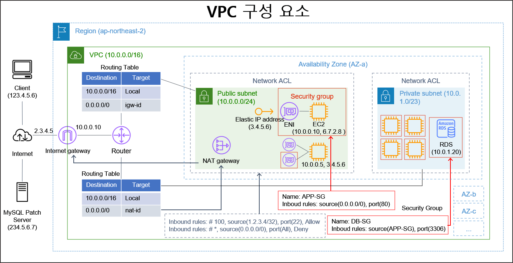

[05-network.pptx](../images/aws/05-vpc.pptx)

Amazon VPC(Virtual Private Cloud)는 AWS 계정 전용으로 분리된 가상 네트워크 격리 영역.

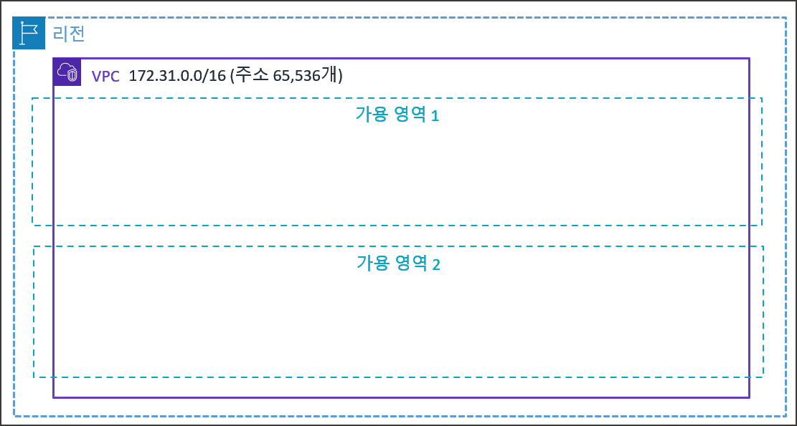

### 2.1.1 Amazon VPC 주요 역할 및 특징
- 리소스 논리적 통합: 물리적으로 분리된 가용 영역(AZ) 및 데이터 센터에 배포된 리소스를 하나의 논리적 네트워크로 묶어 사설 IP 기반의 통신 환경 제공.
- 어플리케이션 트래픽 격리: 동일 계정 내 어플리케이션 구성에 필요한 서비스들을 동일 VPC에 배포하여 하나로 연결하고, 서로 다른 어플리케이션은 독립된 VPC에 배포하여 트래픽 상호 격리.
- 환경별 인프라 분리: 개발, 테스트, 운영 리소스를 각각 별도의 VPC에 배포하여 보안 및 관리 격리 수행.
- 리소스 배포 필수 전제: EC2 인스턴스나 RDS 데이터베이스 등의 리소스를 배포하려면 VPC를 지정해야 함.

## 2.2 서브넷 (Subnet)

- 서브넷은 VPC CIDR 블록을 더 작은 단위로 분할하여 특정 가용 영역에 할당한 IP 주소 범위.
- VPC는 여러 가용 영역에 걸쳐 존재할 수 있으나, 서브넷은 하나의 가용 영역 내에 존재.
- VPC CIDR 대역 범위 내에서 서로 중첩되지 않도록 독립된 CIDR 블록 지정.

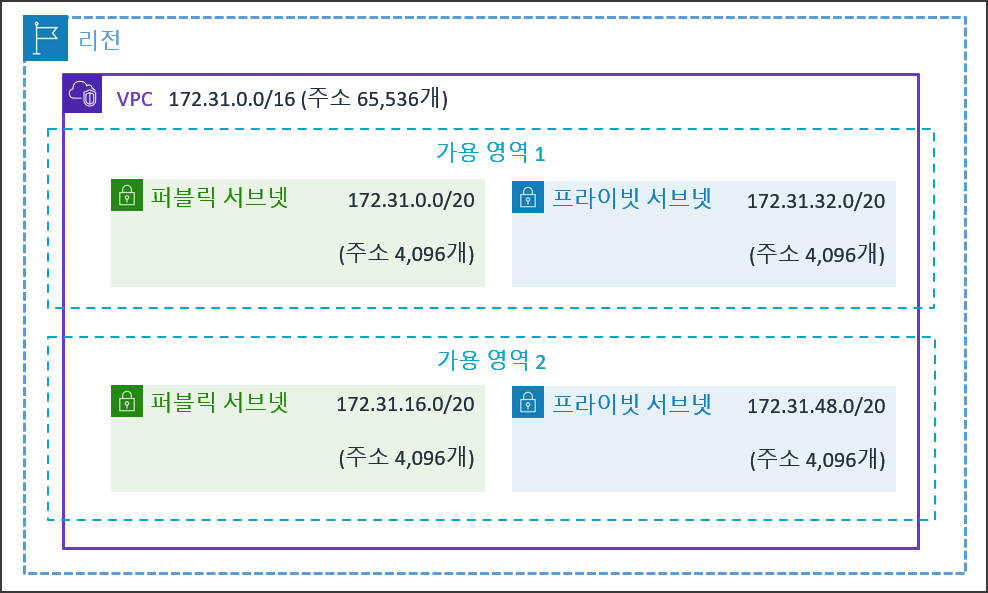

## 2.3 퍼블릭 서브넷과 프라이빗 서브넷

- 서브넷은 라우팅 테이블 연결 상태 및 인터넷 접속 가능 여부에 따라 퍼블릭 서브넷과 프라이빗 서브넷으로 구분.

### 2.3.1 퍼블릭 서브넷 (Public Subnet)

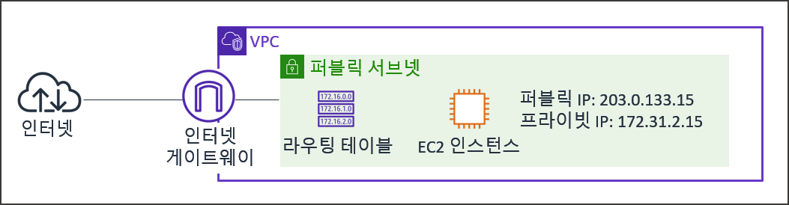

- 인터넷 게이트웨이 [^8] (Internet Gateway, IGW)로 향하는 라우팅 경로가 정의되어 있는 서브넷.
- 외부 인터넷망에서 직접 접근이 가능하며, 웹 서버 배치에 적합.
- 서브넷 내 위치한 리소스가 외부와 통신하기 위해 공인 IP 또는 탄력적 IP 주소 보유 필수.

### 2.3.2 프라이빗 서브넷 (Private Subnet)

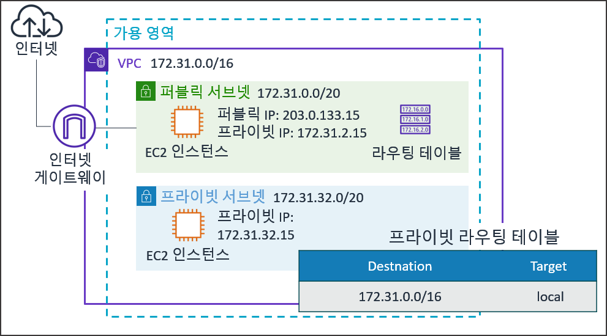

- 인터넷 게이트웨이 [^8]²로 직접 통하는 라우팅 경로가 없는 서브넷.
- 외부 인터넷망에서 직접 접근이 불가능하여 애플리케이션 백엔드 서버, 데이터베이스(RDS), 내부 로직 처리 노드 배치에 활용.
- NAT [^9] (Network Address Translation) 게이트웨이를 통과하도록 라우팅을 구성하면 프라이빗 IP 보안을 유지하면서 외부 아웃바운드 패치 및 라이브러리 다운로드 가능.

---

# 3. VPC 코어 네트워킹 구성 요소

## 3.1 라우팅 테이블 (Route Table)

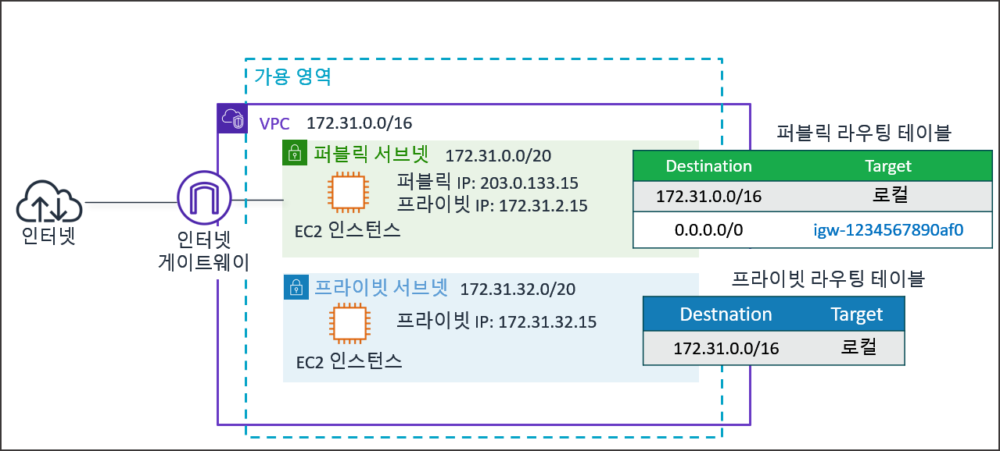

라우팅 테이블은 서브넷 또는 게이트웨이에서 출발한 네트워크 패킷 트래픽이 이동할 다음 목적지(Target)를 결정하는 라우팅 규칙(Route Entry) 모음.

### 3.1.1 라우팅 평가 메커니즘
- VPC 생성 시 기본 라우팅 테이블(Main Route Table)이 자동 생성되며, VPC 내부 리소스 간 통신을 위한 Local 경로는 삭제 불가능.
- 패킷 전송 시 가장 구체적인 CIDR 대역(가장 긴 서브넷 마스크 접두사)을 가진 라우팅 규칙이 최우선 적용.
- 명시적으로 특정 라우팅 테이블과 연결되지 않은 서브넷은 자동으로 기본 라우팅 테이블 적용.

### 3.1.2 라우팅 평가 적용 예시
- 라우팅 규칙 구성
  - 10.0.0.0/16 -> 타깃: local (VPC 내부 통신)
  - 0.0.0.0/0 -> 타깃: igw-xxxxxxx (인터넷 게이트웨이 외부 통신)
- 패킷 라우팅 동작
  - 10.0.1.5 IP로 패킷 전송 시: 10.0.0.0/16 대역에 먼저 일치하므로 VPC 내부(local) 인스턴스로 트래픽 전달.
  - 8.8.8.8 IP로 패킷 전송 시: 10.0.0.0/16 대역에 해당하지 않으므로 0.0.0.0/0 규칙에 따라 인터넷 게이트웨이(igw-xxxxxxx)를 거쳐 외부 인터넷으로 트래픽 전달.

## 3.2 인터넷 게이트웨이 (Internet Gateway, IGW)

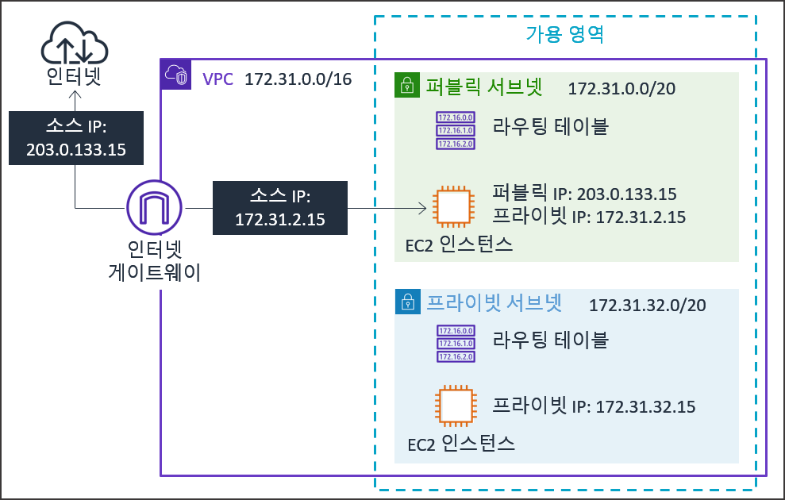

인터넷 게이트웨이는 VPC 내부의 리소스와 외부 인터넷이 서로 통신할 수 있도록 연결해 주는 관문.

### 3.2.1 인터넷 게이트웨이의 역할
- 라우팅 테이블의 타깃(Target)으로 지정해서 VPC 서브넷의 트래픽이 외부 인터넷으로 나갈수 있도록 함.
- 퍼블릭 IP 주소와 프라이빗 IP 주소 간의 NAT [^9]² 작업을 자동 수행.
- 인터넷 게이트웨이는 수평 확장성 및 고가용성을 내장한 완전 관리형 소프트웨어 서비스로, 단일 장애지점 [^10] (SPOF, Single Point of Failure)이 발생하지 않는 논리적 게이트웨이.

## 3.3 NAT 게이트웨이 (NAT Gateway)

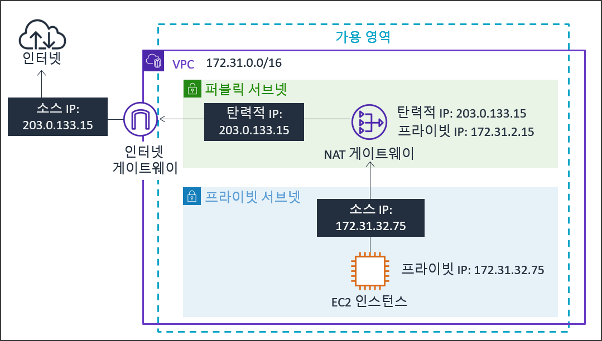

NAT 게이트웨이는 프라이빗 서브넷 내 리소스가 외부 인터넷으로 아웃바운드 요청을 시작할 수 있게 해주면서, 외부 인터넷에서의 인바운드 접속 시도는 차단하는 완전 관리형 주소 변환 서비스.

### 3.3.1 NAT 게이트웨이 동작 구조

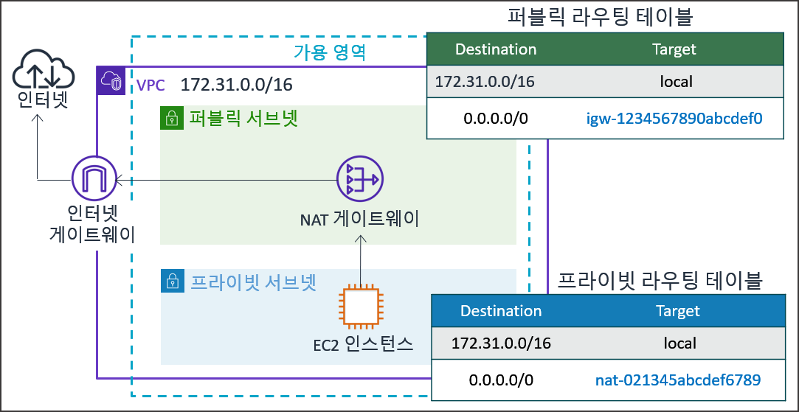

- 퍼블릭 서브넷 내에 배치되어야 하며 고정된 탄력적 IP(EIP) 할당 필요.
- 프라이빗 서브넷의 라우팅 테이블에서 외부 인터넷 트래픽(0.0.0.0/0)의 목적지로 NAT 게이트웨이를 지정.
- 프라이빗 IP 주소를 NAT 게이트웨이의 탄력적 IP 주소로 변환하여 외부로 전송하고, 응답 패킷 수신 시 다시 원래의 프라이빗 IP 주소로 복원.

## 3.4 탄력적 IP 주소 (Elastic IP Address, EIP)

탄력적 IP 주소는 동적 클라우드 환경을 위해 제공되는 고정된 공인 IPv4 주소.

### 3.4.1 탄력적 IP 활용
- EC2 인스턴스를 정지 후 재시작하면 일반 공인 IP는 변경되지만, 탄력적 IP는 주소가 유지.
- 인스턴스 장애 발생 시 다른 가동 중인 인스턴스로 탄력적 IP를 즉시 재매핑하여 장애 복구(Failover) 구현.
- 리전당 계정별 기본 5개까지 할당 제한 적용.

## 3.5 탄력적 네트워크 인터페이스 (Elastic Network Interface, ENI)

ENI는 VPC 내 가상 네트워크 카드를 나타내는 논리적 네트워킹 구성 요소.

### 3.5.1 ENI 구성 및 이동성
- 프라이빗 IP 주소, EIP, MAC 주소, 보안 그룹 설정을 하나의 카드 단위에 바인딩.
- 동일 가용 영역 내에 존재하는 다른 EC2 인스턴스로 ENI를 분리 후 재연결 가능하여 네트워크 주소 정보 및 보안 정책 유지.
- 이중 홈 인스턴스(Dual-homed Instance) 구성 시 분리된 관리용 네트워크망 구현에 활용.

---

# 4. 네트워크 보안 및 접근 제어

## 4.1 보안 그룹 (Security Group)

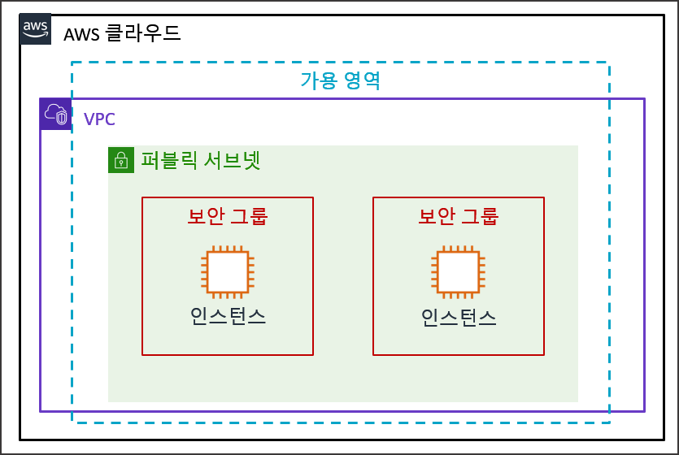

보안 그룹은 EC2 인스턴스 직전 단계에서 트래픽을 제어하는 인스턴스 레벨 가상 방화벽.

### 4.1.1 보안 그룹 주요 특징

- Stateful [^11] (상태 저장) 방식 적용: 인바운드 트래픽이 허용되면 그에 대한 아웃바운드 응답 트래픽은 아웃바운드 규칙 설정과 무관하게 자동 허용.
- 허용(Allow) 규칙만 정의 가능하며, 거부(Deny) 규칙은 명시 불가.
- 신규 보안 그룹 생성 시 기본적으로 모든 인바운드 차단, 모든 아웃바운드 허용 상태로 설정됨.
- 규칙 설정 시 IP 대역(CIDR)뿐만 아니라 다른 보안 그룹 ID를 소스(Source)로 지정하여 보안 그룹 간 트래픽 허용 체계 구축 가능.

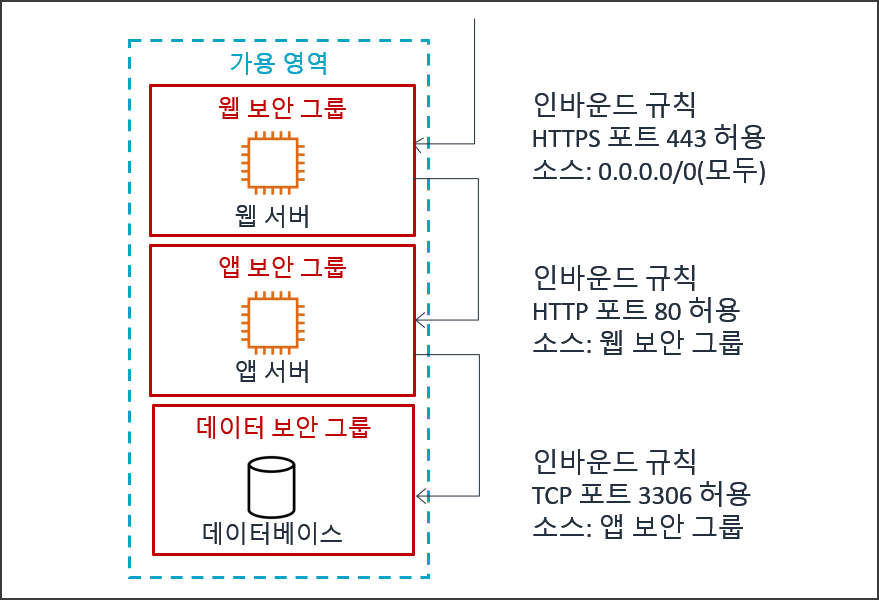

## 4.2 네트워크 ACL (Network Access Control List, NACL)

네트워크 ACL은 서브넷 경계 영역에서 서브넷을 입출력하는 패킷 트래픽을 통제하는 서브넷 레벨 가상 방화벽.

### 4.2.1 네트워크 ACL 주요 특징
- Stateless [^12] (상태 비저장) 방식 적용: 인바운드 트래픽이 허용되었더라도 아웃바운드 트래픽 규칙에 해당 응답 포트가 허용되어 있지 않으면 패킷 차단.
- 허용(Allow) 규칙과 거부(Deny) 규칙을 모두 명시적으로 설정 가능.
- 규칙 번호(Rule Number) 기반으로 동작하며 낮은 번호의 규칙부터 순차적으로 우선 평가.
- 어떤 규칙과도 일치하지 않는 트래픽은 맨 마지막 별표(*) 규칙에 의해 자동 거부(Deny).

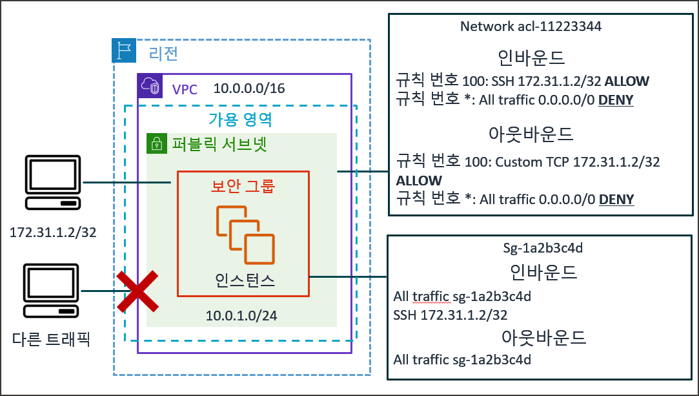

## 4.3 보안 그룹과 네트워크 ACL 비교

| 구분 항목 | 보안 그룹 (Security Group) | 네트워크 ACL (Network ACL) |
| :--- | :--- | :--- |
| 적용 수준 | 인스턴스 레벨 (ENI 단계) | 서브넷 레벨 (Subnet 경계) |
| 동작 방식 | Stateful [^11]2 (상태 저장) | Stateless [^12]2 (상태 비저장) |
| 규칙 구성 | 허용(Allow) 규칙만 지원 | 허용(Allow) 및 거부(Deny) 규칙 모두 지원 |
| 규칙 평가 | 모든 규칙을 종합적으로 평가 | 규칙 번호 순서대로 순차 평가 (우선순위 적용) |
| 적용 대상 | EC2 인스턴스에 각각 적용 | 서브넷 내 모든 리소스에 일괄 적용 |
| 신규 생성시 기본 상태 | 모든 인바운드 차단, 모든 아웃바운드 허용 | 모든 인바운드 및 아웃바운드 차단 |

## 4.4 심층 방어 계층 아키텍처

VPC 보안은 다중 방어 계층(Defense-in-Depth)으로 설계하는 것이 모범 사례.

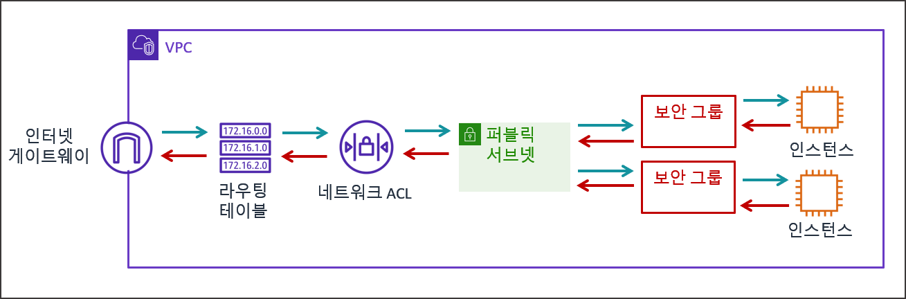

## 4.5 기본 VPC (Default VPC) 구성 요소

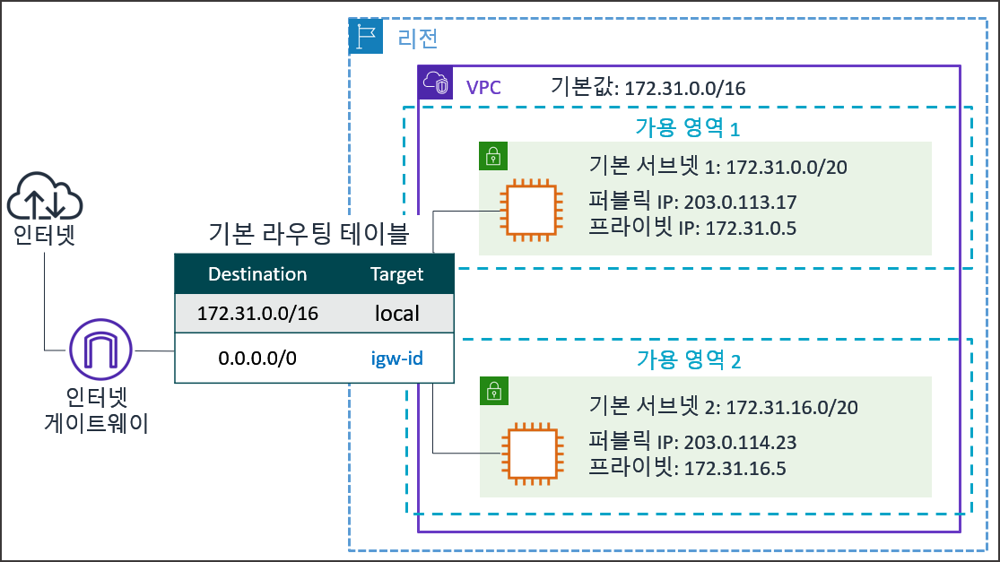

AWS 계정을 생성하면 각 리전마다 다음과 같은 기본 VPC(Default VPC) 요소들이 자동으로 만들어져 제공됨.

- Default VPC: 각 리전별로 172.31.0.0/16 CIDR 대역(총 65,536개 IP)을 사용하는 기본 VPC가 생성됨.
- 퍼블릭 서브넷 (Public Subnet): 리전 내 가용 영역(AZ)별로 /20 CIDR 대역(각 4,096개 IP)의 퍼블릭 서브넷이 1개씩 기본으로 생성됨.
- 인터넷 게이트웨이 (IGW): 외부 인터넷 통신을 담당하는 인터넷 게이트웨이가 기본으로 생성됨.
- 라우팅 테이블 (Route Table): IGW 경로(0.0.0.0/0)를 포함하는 메인 라우팅 테이블이 생성되어 퍼블릭 서브넷들과 기본으로 연결됨.
- 네트워크 ACL (NACL): 모든 트래픽을 허용하는 서브넷 레벨의 기본 네트워크 ACL이 생성됨.
- 보안 그룹 (Security Group): 인바운드 규칙이 기본 보안 그룹(Self) 내의 트래픽만 허용되도록 설정된 Default 보안 그룹이 생성됨.

# 5. VPC 실습

## 5.1 커스텀 VPC 인프라 구축 개요

AWS 관리 콘솔을 활용하여 10.0.0.0/16 사설 대역을 가질 가상 네트워크(VPC)를 구축하고, 퍼블릭/프라이빗 서브넷 분리 배치 및 라우팅 경로를 체계적으로 연결하는 실습

### 5.1.1 실습 목표 인프라 사양
- VPC: `spring-board-vpc` (IPv4 CIDR: `10.0.0.0/16`)
- 퍼블릭 서브넷: `spring-board-public-subnet-2a` (IPv4 CIDR: `10.0.1.0/24`, 가용 영역: `ap-northeast-2a`)
- 프라이빗 서브넷: `spring-board-private-subnet-2a` (IPv4 CIDR: `10.0.2.0/24`, 가용 영역: `ap-northeast-2a`)
- 인터넷 게이트웨이: `spring-board-igw` (`spring-board-vpc` 연결)
- 탄력적 IP 및 NAT 게이트웨이: `spring-board-nat-gw` (퍼블릭 서브넷 배치)
- 라우팅 테이블:
  - 퍼블릭 라우팅 테이블: `spring-board-public-rt` (`0.0.0.0/0` -> `spring-board-igw`, `spring-board-public-subnet-2a` 연결)
  - 프라이빗 라우팅 테이블: `spring-board-private-rt` (`0.0.0.0/0` -> `spring-board-nat-gw`, `spring-board-private-subnet-2a` 연결)
- 보안 그룹: `spring-board-web-sg` (Inbound: HTTP 80, SSH 22 허용)
- 리소스 식별 태그: Key: `Project` / Value: `spring-board` (모든 구성 요소에 공통 적용)

## 5.2 커스텀 VPC 생성

### 5.2.1 AWS VPC 콘솔 메뉴 접속
- AWS 관리 콘솔 로그인 완료 후 화면 최상단 검색창 클릭.
- 검색어 `VPC` 입력 후 서비스 결과 목록에서 [VPC] 클릭하여 대시보드 이동.

### 5.2.2 VPC 생성 마법사 실행
- VPC 대시보드 화면 상단에 위치한 오렌지색 [VPC 생성] 버튼 클릭.
- 설정 옵션 중 [생성할 리소스] 영역에서 [VPC만] 라디오 버튼 선택.

### 5.2.3 VPC 이름, CIDR 대역 및 태그 설정
- [이름 태그] 입력란에 `spring-board-vpc` 입력.
- [IPv4 CIDR 수동 입력] 라디오 버튼 선택 유지.
- [IPv4 CIDR] 입력란에 `10.0.0.0/16` 입력.
- [IPv6 CIDR 블록] 영역에서 [IPv6 CIDR 블록 없음] 선택 유지.
- [테넌시] 드롭다운 메뉴에서 [기본값] 선택 유지.
- [태그] 영역 하단의 [태그 추가] 버튼 클릭 후 [키] 입력란에 `Project`, [값] 입력란에 `spring-board` 입력.

### 5.2.4 VPC 생성 완료
- 화면 우측 최하단의 오렌지색 [VPC 생성] 버튼 클릭.
- VPC 상세 화면으로 전환되면 상태가 Available인지 확인.

## 5.3 퍼블릭 및 프라이빗 서브넷 생성

### 5.3.1 서브넷 관리 메뉴 이동
- VPC 대시보드 좌측 탐색 창 메뉴에서 [서브넷] 클릭.
- 서브넷 목록 화면 우측 상단의 [서브넷 생성] 버튼 클릭.

### 5.3.2 대상 VPC 지정
- [VPC ID] 드롭다운 선택 메뉴 클릭.
- 이전 단계에서 생성한 `spring-board-vpc` 선택.

### 5.3.3 퍼블릭 서브넷 정보 및 태그 설정
- [서브넷 설정] 영역 내 [서브넷 이름] 입력란에 `spring-board-public-subnet-2a` 입력.
- [가용 영역] 드롭다운 메뉴 클릭 후 `ap-northeast-2a` 선택.
- [IPv4 서브넷 CIDR 블록] 입력란에 `10.0.1.0/24` 입력.
- 하단 [태그] 영역 내 [새 태그 추가] 버튼 클릭 후 [키] 입력란에 `Project`, [값] 입력란에 `spring-board` 입력.

### 5.3.4 프라이빗 서브넷 정보 및 태그 설정 추가
- 서브넷 설정 영역 하단에 위치한 [새 서브넷 추가] 버튼 클릭.
- 추가된 서브넷 폼 내 [서브넷 이름] 입력란에 `spring-board-private-subnet-2a` 입력.
- [가용 영역] 드롭다운 메뉴 클릭 후 `ap-northeast-2a` 선택 (동일 가용 영역 지정).
- [IPv4 서브넷 CIDR 블록] 입력란에 `10.0.2.0/24` 입력.
- 추가된 서브넷 폼 하단 [태그] 영역 내 [새 태그 추가] 버튼 클릭 후 [키] 입력란에 `Project`, [값] 입력란에 `spring-board` 입력.

### 5.3.5 서브넷 생성 실행
- 화면 우측 최하단의 오렌지색 [서브넷 생성] 버튼 클릭.
- 서브넷 목록에 `spring-board-public-subnet-2a` 및 `spring-board-private-subnet-2a` 정상 추가 여부 확인.

### 5.3.6 퍼블릭 서브넷에 자동 퍼블릭 IP 할당 옵션 설정
- 서브넷 목록에서 `spring-board-public-subnet-2a` 항목 좌측 체크박스 선택.
- 화면 우측 상단 [작업] 드롭다운 버튼 클릭 후 [서브넷 설정 편집] 클릭.
- [자동 할당 IP 설정] 영역 내 [퍼블릭 IPv4 주소 자동 할당 활성화] 체크박스 선택.
- 화면 우측 하단 [저장] 버튼 클릭.
- 이제 퍼블릭 서브넷에 배포하는 리소스에는 자동으로 퍼블릭 IP가 부여됨

## 5.4 인터넷 게이트웨이 생성 및 VPC 연결

### 5.4.1 인터넷 게이트웨이 메뉴 이동
- VPC 대시보드 좌측 탐색 창 메뉴에서 [인터넷 게이트웨이] 클릭.
- 화면 우측 상단의 [인터넷 게이트웨이 생성] 버튼 클릭.

### 5.4.2 인터넷 게이트웨이 이름 및 태그 지정
- [인터넷 게이트웨이 설정] 영역 내 [이름 태그] 입력란에 `spring-board-igw` 입력.
- 하단 [태그] 영역 내 [새 태그 추가] 버튼 클릭 후 [키] 입력란에 `Project`, [값] 입력란에 `spring-board` 입력.
- 화면 우측 하단의 [인터넷 게이트웨이 생성] 버튼 클릭.

### 5.4.3 VPC 연결 실행
- 생성 직후 상세 화면 우측 상단의 [작업] 드롭다운 버튼 클릭 후 [VPC에 연결] 클릭.
- [VPC 선택]을 클릭하여 `spring-board-vpc` 선택.
- 화면 우측 하단의 [인터넷 게이트웨이 연결] 버튼 클릭.
- 인터넷 게이트웨이 상태가 `Detached`에서 `Attached`로 변경됨을 확인.

## 5.5 라우팅 테이블 생성 및 서브넷 연결

### 5.5.1 퍼블릭 라우팅 테이블 구성

#### 1) 퍼블릭 라우팅 테이블 신규 생성 및 태그 설정
- VPC 대시보드 좌측 탐색 창 메뉴에서 [라우팅 테이블] 클릭.
- 화면 우측 상단의 [라우팅 테이블 생성] 버튼 클릭.
- [이름] 입력란에 `spring-board-public-rt` 입력.
- [VPC 선택]을 클릭하여 `spring-board-vpc` 선택.
- 하단 [태그] 영역 내 [새 태그 추가] 버튼 클릭 후 [키] 입력란에 `Project`, [값] 입력란에 `spring-board` 입력.
- 화면 우측 하단 [라우팅 테이블 생성] 버튼 클릭.

#### 2) 인터넷 게이트웨이 라우팅 경로 추가
- 생성된 `spring-board-public-rt` 상세 화면 하단 탭 메뉴 중 [라우팅] 탭 클릭.
- 우측 [라우팅 편집] 버튼 클릭.
- 라우팅 테이블 편집 화면에서 [라우팅 추가] 버튼 클릭.
- [대상(Destination)] 입력란을 클릭하여 `0.0.0.0/0` 선택.
- [대상(Target)] 드롭다운 메뉴 클릭 후 [인터넷 게이트웨이] 선택 및 목록에서 `spring-board-igw` 선택.
- 화면 우측 하단 [변경 사항 저장] 버튼 클릭.

#### 3) 퍼블릭 서브넷 명시적 연결
- `spring-board-public-rt` 상세 화면 하단 탭 메뉴 중 [서브넷 연결] 탭 클릭.
- [명시적 서브넷 연결] 영역의 우측 [서브넷 연결 편집] 버튼 클릭.
- [이용 가능한 서브넷] 목록에서 `spring-board-public-subnet-2a` 항목 좌측 체크박스 선택.
- 화면 우측 하단 [연결 저장] 버튼 클릭.

### 5.5.2 프라이빗 라우팅 테이블 구성

#### 1) 프라이빗 라우팅 테이블 신규 생성 및 태그 설정
- VPC 대시보드 좌측 탐색 창 메뉴에서 [라우팅 테이블] 클릭.
- 화면 우측 상단의 [라우팅 테이블 생성] 버튼 클릭.
- [이름] 입력란에 `spring-board-private-rt` 입력.
- [VPC 선택]을 클릭하여 `spring-board-vpc` 선택.
- 하단 [태그] 영역 내 [새 태그 추가] 버튼 클릭 후 [키] 입력란에 `Project`, [값] 입력란에 `spring-board` 입력.
- 화면 우측 하단 [라우팅 테이블 생성] 버튼 클릭.

#### 2) 프라이빗 서브넷 명시적 연결
- `spring-board-private-rt` 상세 화면 하단 탭 메뉴 중 [서브넷 연결] 탭 클릭.
- [명시적 서브넷 연결] 영역의 우측 [서브넷 연결 편집] 버튼 클릭.
- [이용 가능한 서브넷] 목록에서 `spring-board-private-subnet-2a` 항목 좌측 체크박스 선택.
- 화면 우측 하단 [연결 저장] 버튼 클릭.

## 5.6 NAT 게이트웨이 생성 및 프라이빗 라우팅 연동

### 5.6.1 NAT 게이트웨이 메뉴 이동
- VPC 대시보드 좌측 탐색 창 메뉴에서 [NAT 게이트웨이] 클릭.
- 화면 우측 상단의 [NAT 게이트웨이 생성] 버튼 클릭.

### 5.6.2 NAT 게이트웨이 상세 설정 및 태그 지정
- [이름] 입력란에 `spring-board-nat-gw` 입력.
- [가용성 모드] 항목의 [영역별] 라디오 버튼 선택.
- [서브넷] 드롭다운 선택 메뉴 클릭 후 퍼블릭 서브넷인 `spring-board-public-subnet-2a` 선택.
- [연결 유형] 라디오 버튼 중 [퍼블릭] 선택 유지.
- [탄력적 IP 할당 ID] 영역 우측의 [탄력적 IP 할당] 버튼 클릭하여 EIP 주소 신규 생성 및 자동 매핑.
- 하단 [태그] 영역 내 [새 태그 추가] 버튼 클릭 후 [키] 입력란에 `Project`, [값] 입력란에 `spring-board` 입력.
- 화면 우측 하단의 [NAT 게이트웨이 생성] 버튼 클릭.

### 5.6.3 프라이빗 라우팅 테이블 경로 연동
- 좌측 탐색 창 메뉴에서 [라우팅 테이블] 클릭 및 `spring-board-private-rt` 선택.
- 하단 탭 메뉴 중 [라우팅] 탭 클릭 후 [라우팅 편집] 버튼 클릭.
- [라우팅 추가] 버튼 클릭.
- [대상(Destination)] 입력란을 클릭하여 `0.0.0.0/0` 선택.
- [대상(Target)] 드롭다운 메뉴 클릭 후 [NAT 게이트웨이] 선택 및 목록에서 `spring-board-nat-gw` 선택.
- 화면 우측 하단 [변경 사항 저장] 버튼 클릭.

## 5.7 보안 그룹 생성 및 규칙 설정

### 5.7.1 웹 서버용 보안 그룹 설정

#### 1) 보안 그룹 생성 메뉴 이동
- VPC 대시보드 좌측 탐색 창 메뉴 항목 중 [보안 그룹] 클릭.
- 화면 우측 상단의 [보안 그룹 생성] 버튼 클릭.

#### 2) 기본 정보 지정 및 태그 추가
- [보안 그룹 이름] 입력란에 `spring-board-web-sg` 입력.
- [설명] 입력란에 `Security Group for Spring Board Web Application` 입력.
- [VPC] 드롭다운 선택 메뉴 클릭 후 `spring-board-vpc` 선택.
- 하단 [태그] 영역 내 [새 태그 추가] 버튼 클릭 후 [키] 입력란에 `Project`, [값] 입력란에 `spring-board` 입력.

#### 3) 인바운드 보안 규칙 정의
- [인바운드 규칙] 영역 하단의 [규칙 추가] 버튼 클릭.
- 첫 번째 규칙: [유형] 드롭다운에서 HTTP 선택 (포트 범위 80 자동 입력됨), [소스] 드롭다운에서 Anywhere-IPv4 선택.
- [규칙 추가] 버튼 다시 클릭.
- 두 번째 규칙: [유형] 드롭다운에서 SSH 선택 (포트 범위 22 자동 입력됨), [소스] 드롭다운에서 내 IP 선택

#### 4) 아웃바운드 보안 규칙 확인 및 저장
- [아웃바운드 규칙] 영역에 기본으로 등록된 모든 트래픽(`0.0.0.0/0`) 허용 상태 유지.
- 화면 우측 최하단의 [보안 그룹 생성] 버튼 클릭하여 최종 생성 완료.

## 5.8 EC2 인스턴스 배포 테스트

---

[^1]: Node (노드) - 네트워크에 연결되어 데이터를 송수신하거나 중계할 수 있는 컴퓨터, 서버, 라우터 등의 개별 통신 지점 및 네트워크 디바이스.
[^2]: Routing (라우팅) - 네트워크 데이터 패킷이 출발지에서 목적지까지 이동할 때 최적의 경로를 지정하여 전달하는 통신 제어 과정.
[^3]: Subnet Mask (서브넷 마스크) - 32비트 IP 주소에서 네트워크 영역 비트를 1로, 호스트 영역 비트를 0으로 지정하여 두 영역을 구별해 주는 32비트 마스크 값.
[^4]: Bitwise AND Operation (이진 연산) - 비트 단위 논리 연산자로, 두 비트가 모두 1일 때만 결과가 1이 되고 나머지는 0이 되는 비트 연산 방식. IP 주소와 서브넷 마스크를 AND 연산하여 네트워크 주소를 추출할 때 사용.
[^5]: DHCP (Dynamic Host Configuration Protocol) - 네트워크 장치에 IP 주소 및 관련 제어 정보를 자동으로 할당해 주는 네트워크 관리 프로토콜.
[^6]: RFC (Request for Comments) - 국제 인터넷 표준화 기구(IETF)에서 공표하는 인터넷 기술 관련 표준 규격 및 프로토콜 문서 모음. RFC 1918은 사설망 전용 IPv4 주소 공간(10.0.0.0/8, 172.16.0.0/12, 192.168.0.0/16)을 지정한 대표적인 기술 명세.
[^7]: CIDR (Classless Inter-Domain Routing) - 클래스 개념을 대체하여 IP 주소를 효율적으로 할당하고 라우팅하기 위해 가변 길이의 서브넷 마스크(VLSM)를 사용하는 표기 방식.
[^8]: IGW (Internet Gateway) - VPC의 퍼블릭 서브넷과 외부 인터넷망 간 양방향 데이터 트래픽 통신을 가능하게 하는 AWS 고가용성 소프트웨어 관문.
[^9]: NAT (Network Address Translation) - 사설 IP 주소를 공인 IP 주소로 변환하거나 그 반대로 주소를 변환하여 외부 인터넷과 통신하게 해주는 주소 변환 기술.
[^10]: SPOF (Single Point of Failure, 단일 장애지점) - 해당 구성 요소가 고장 나면 시스템 전체가 마비되는 단일 약점 지점.
[^11]: Stateful (상태 저장) - 요청된 네트워크 연결 정보를 기억하여 허용된 요청의 응답 트래픽에 대해 반대 방향 규칙과 무관하게 자동으로 흐름을 허용하는 방식.
[^12]: Stateless (상태 비저장) - 네트워크 요청 연결 상태 정보를 기억하지 않아 인바운드와 아웃바운드 트래픽에 대한 허용 규칙을 각각 명시적으로 정의해야 하는 방식.
